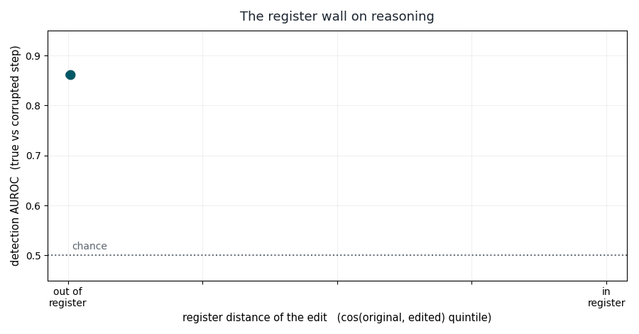

<div align="center">


# Groundlens: the deterministic first stage for RAG and agent loops. It decides what your LLM judge has to look at.
</div>

<div align="center">

[](https://github.com/groundlens-dev/groundlens)
[](https://github.com/groundlens-dev/groundlens/actions)
[](https://docs.groundlens.dev)
[](https://github.com/groundlens-dev/groundlens/releases)
[](https://www.apache.org/licenses/LICENSE-2.0)
[](https://scorecard.dev/viewer/?uri=github.com/groundlens-dev/groundlens)
[](https://www.bestpractices.dev/projects/13390)


</div>
<div align="center">

<br>
<sub> The Groundlens MCP inside Claude: a deterministic CHECK under every answer. </br> Question 4 asks for a figure the report never gives — Claude declines, and the check catches it anyway: provenance, not truth.</sub>
</div>

</br>

</br>


## TABLE OF CONTENTS
  - [:framed_picture: Hallucinations Taxonomy](#hallucinationstaxonomy)
  - [:compass: What is Groundlens](#whatisgroundlens)
    - [Goundlens as the first stage](#goundlensasthefirststage)
    - [NLI as the complementary stage](#nliasthecomplementarystage)
    - [Do we need an LLM judge as third stage](#doweneedanLLMjudgeasthirdstage)
    - [Human review](#humanreview)
    - [Proposed stack](#proposedstack)
    - [Rules based auditing](#rulesbasedauditing)
  - [:white_check_mark: Benchmarks](#benchmarks)
    - [The register wall](#theregisterwall)
    - [Reasoning chains](#reasoningchains)
    - [The ceiling, and the authorship shortcut](#theceiling,andtheauthorshipshortcut)
    - [Google DeepMind's FACTS](#googlefeepMind'sfacts)
    - [Evaluation checklist](#evaluationchecklist)
    - [Comparison table](*comparisontable:crossingthegeometricwall)
 - [:arrow_forward: Quick setup](#quicksetup)
 - [:bar_chart: Interpretable scores](#interpretablescores)
 - [:white_square_button: Custom encoders](#customencoders)
 - [:anchor: Calibrating SGI and DGI](*calibratingsgiandgi)
    - [Bootstrap calibration set for DGI](#bootstrapcalibrationsetfordgi)
    - [Calibration limits](#calibrationlimits)
 - [:books: Rule sets](#rulesets)
    - [Builing your own rule set](#builingyourownruleset)
 - [:knot: Integrations](#integrations)
 - [:ladder: Architecture](#architecture)
 - [:page_facing_up: Research](#research)
 - [:round_pushpin: Compliance mapping](#compliancemapping)
   
   
---
  
## :framed_picture: Hallucinations taxonomy

A model can go wrong in ways that look alike on the surface but have nothing in common underneath. It can ignore the document you gave it and answer from memory. It can wander off topic and invent something unrelated. It can stay perfectly on topic and get one fact wrong. Calling all three "hallucination" hides the fact that they have different causes and need different tools. The first two leave a trace in the geometry of the text and can be caught cheaply. The third does not, and no similarity score will ever catch it; it needs a source check or a person. Until you separate them, you cannot tell which one you are dealing with, so you cannot choose the right check.
A taxonomy is what lets you say, precisely, what your tool catches and what it does not. Without it you are stuck with a vague claim, "detects hallucinations," that is either overselling or impossible to test. With it you can state scope plainly: catches these kinds, blind to that kind, escalate that kind elsewhere. That precise statement is exactly what makes the tool trustworthy to someone whose job is to manage the risk, and it is what stops a user from deploying it where it is blind.
It also keeps you accountable in measurement. If you pool every failure into one accuracy number, you hide the place where your method collapses. Reporting by type forces the number to tell the truth, including the uncomfortable part.
So the taxonomy is not academic tidiness. It is the thing that turns a marketing word into an engineering specification: named failures, matched to the checks that catch them, with the blind spot declared as a category rather than discovered in production.

| Hallucination type | What it looks like | Detectable by Groundlens? |
|---|---|---|
| **Type I — Query-proximate unfaithfulness** | Response ignores the retrieved context and defaults to the question's topic | **SGI**, when context is available. HaluEval QA AUROC ≈ 0.81 (mean over five encoders). *Pending the authorship and length controls: this figure predates them and has not been re-run.* |
| **Type II — Confabulation outside plausibility region** | Response imports vocabulary from an adjacent register (e.g., describing CRISPR using protein-folding terms) | **DGI**, declared-limited. DGI separates a confabulation that leaves the register of a correct answer. Its skill declines toward chance as the confabulation stays *in* register, which is the case that matters in production. With authorship held constant, DGI reaches AUROC 0.606 and the ceiling of the whole embedding-similarity class is ~0.68. Escalate in-register cases to Stage 2. |
| **Type III — Factual error within the same frame** | Wrong number, wrong name, wrong date — same vocabulary, same topic, same syntax as the correct answer | **NOT** detectable by any embedding-similarity score, ours included. At chance on TruthfulQA. This is a declared blind spot, not a tuning problem. Escalate to Stage 2: an entailment check (NLI), a source lookup, a KG check, or a human. Entailment is the method that *does* hold up here — see [The register wall](#the-register-wall). The same blind spot has now been measured on multi-step reasoning chains, not only single questions: see the [reasoning-chains benchmark](#reasoning-chains). |

## :compass: What is Groundlens

Groundlens is a fast, deterministic first-pass filter that uses embedding geometry, not a second language model, to catch the answers that drifted off their source or ignored the question, so you only pay for slower checks like entailment or a human on the cases it cannot settle.

### Goundlens as the first stage

The standard way to check an LLM's output is a second LLM as judge, paid on every output: non-deterministic at temperature 0, a free-text opinion with no citation, priced per call. 

<div align="center">
    
**Groundlens is the deterministic **first stage** that runs in front of that judge.** 

</div>
    
Two deterministic layers, geometric scoring and citation-backed rules, clear the clearly grounded answers and catch the clearly ungrounded ones, sub-second, with no LLM in the scoring path, so the expensive judge runs only on what Groundlens escalates. It settles whether an answer engaged its source. A plausible wrong fact stated in the right frame is invisible to geometry, and Groundlens escalates it to your second stage. Built for RAG systems and agent loops in regulated industries.

Groundlens ships two geometric scores: **SGI**, a context-grounded score that compares a response against its retrieved source, and **DGI**, a context-free score that works from the question and answer alone. Where each one holds, and where it does not, is stated precisely below.

### NLI as the complementary stage

NLI is the recommended second stage, and geometry runs before it. So the question is not "SGI versus NLI." It is "what is left for a first stage once you have decided NLI is your second stage."


|NLI limitations|
|---|
|NLI needs a premise. DGI does not. In open chat, tool use, or any no-retrieval path, there is no document to entail against. NLI has nothing to run. DGI is context-free by construction. That is a whole regime where NLI is simply inapplicable and geometry is the only cheap signal you have.|
|Cost at the screen. An NLI cross-encoder is a full transformer forward pass per claim-premise pair, and in RAG the pairs explode: many chunks times many claims. SGI and DGI are one embedding per text, often already computed for retrieval, plus a dot product. If you run NLI on all traffic you are paying the expensive judge on the 80 to 90 percent of cases a free screen already settles. The entire economic argument for two stages is to not do that. Geometry earns its place by being the thing that decides what even reaches NLI.|
| Determinism and audit. The geometric score traces to distances and angles you can write on a page and reproduce exactly. NLI is a supervised model with its own training distribution, its own drift across versions, and its own logit you cannot fully explain to an examiner. For your De La Chica reader, the geometric layer is the auditable floor; NLI is a second opinion you invoke, not the deterministic control.|
|NLI answers faithfulness, not provenance. Recall the FACTS split. "Is this claim supported" is NLI's question. "Did this answer actually come from the document I was required to use, and not from the model's general knowledge" is a different question, and it is a compliance failure that NLI passes and a distance ratio catches. An answer can be entailed by world knowledge yet ungrounded in the retrieved source.|
|NLI is not a free lunch on robustness. NLI models are the textbook case of shortcut learning: HANS showed they lean on syntactic heuristics, they degrade out of domain, they force you to chunk long premises and thereby lose cross-sentence entailment, and their calibration moves across domains. The 0.89 is a curated-benchmark number, not a field guarantee. So "much more effective" is true on the controlled in-register test and softer in deployment.|

> **Tip**
> NLI sits at stage two, inside the system, called on the residue that geometry cannot settle. Geometry's job is the part NLI is bad at or cannot reach: the no-context case, the cheap high-volume screen, the deterministic audit trail, and the provenance question. 

> **Tip**
> **Use Groundlens in your editor:** the [**Groundlens MCP server**](https://github.com/groundlens-dev/groundlens-mcp) adds deterministic hallucination checks to Claude, Cursor, and VS Code — [one-click install ›](https://github.com/groundlens-dev/groundlens-mcp#one-click-install)


</br>
:point_right: You can use our live demo in HuggingFace: [groundlens-demo.hf.space](https://groundlens-demo.hf.space)

### Do we need an LLM judge as third stage
An LLM judge is warranted only for compositional faithfulness and answer-quality failures, the ones that need reasoning over evidence rather than a single entailment decision, and only as a volume reducer between NLI and a human. It is the tier that is smarter than NLI and cheaper than a person, sitting on a residue that stages one and two have already shrunk enough to afford it. 

### Human review

Human review is mandatory at the intersection of two conditions: the failure is not verifiable by any machine check you have, and the cost of being wrong is irreversible or unbounded. Neither alone forces a human. Together they do, and no detector accuracy number buys you out of it.

Two main reasons: 
- [X] Epistemic: the machine cannot know
- [X] Consequential: the machine might know, but you cannot accept its residual error rate given what is at stake

### Proposed Stack

| Situation | Aproach |
|---|---|
| Type I and Type II confabulations | Geometry methods |
| Type III factual and checkable against a source | NLI or a knowledge-base lookup resolves, deterministically |
| Compositional faithfulness, multi-hop, relevance, completeness | LLM judge is justified, and only grounded with the source and ideally a different model |
| Irreducible | A plausible wrong figure with no available source, or anything high enough stakes that you will not accept a model's word, goes to a human regardless |


### Rules based auditing
Groundlens verifies agent outputs with two layers stitched into one audit packet. Neither alone is enough; the combination is what a Model Risk Committee, an internal audit, or an external supervisor accepts.

- **Geometric scoring** (SGI, DGI) — continuous, calibrated, sub-second. Captures semantic drift that rules miss, and produces a ranking signal for prioritized review queues at production scale.
- **Rule-based audit** — per-rule pass/fail with a citation to the academic, industrial, or regulatory source that motivated the check. Byte-identical reproducibility across years and runs.
- **Bring your own embeddings** — inject any encoder via `encoder=` (or `set_default_encoder(...)` once). Score with a hosted embedding API, an in-house model, or precomputed vectors — and run SGI/DGI **without torch**.

Groundlens is **Stage 1**: it runs first, deterministically, on every output. The expensive LLM-as-judge (or a human) is **Stage 2**, and it runs only on what Stage 1 escalates.

| Stage | Component | What it answers | Limit alone |
|---|---|---|---|
| **Stage 1** | Geometric scoring (SGI, DGI) | "How far is this response from the grounded reference distribution, on a continuous scale?" | No human-readable trail per response; can't say *why* it drifted |
| **Stage 1** | Rule-based audit | "Which specific fact, citation, or procedural element is missing or fabricated, and on what authority?" | Binary checks; doesn't capture semantic drift outside the rule patterns |
| Stage 2 (downstream) | LLM-as-judge or human | "Does this look right, and is the fact true?" | Non-deterministic at T=0; free-text reasons, no citations; ~$300/M outputs. Run it only on what Stage 1 escalates. |

Stage 1 gives you two things Stage 2 cannot afford at scale: a **continuous score** to triage the bottom 5% of a million daily outputs, and a **citation-backed audit trail** an auditor can reproduce two years from now, tied together by a hash-chained log. What Stage 1 cannot settle, a plausible in-register factual error, it escalates to Stage 2. Without Stage 1 you run the expensive judge on everything; without Stage 2 you cannot settle facts.


## :white_check_mark: Benchmarks

Groundlens is measured against published benchmarks and against an independent one. The point of this section is not a single headline number — it is to show, precisely, where geometry wins and where it does not. We lead with the controlled result, because it is the one that has passed authorship and length controls; the provisional numbers follow, clearly marked.

### The register wall

The central result, and the reason the numbers in this section are not the ones we published before. Full write-up: *The Register Wall: What Similarity-Based Hallucination Detectors Actually Measure* (under review).

Bin confabulations by how far they sit from the register of a correct answer, and every distributional and embedding-similarity detector, ours included, declines toward chance as the confabulation moves *in* register: same vocabulary, same phrasing, same structure. Entailment does not.

| Detector | Out of register | In register |
|---|---|---|
| NLI cross-encoder (supervised) | 0.836 | **0.887** |
| Classic encoders (MiniLM, mpnet, bge, gte) | 0.70 – 0.74 | **0.62 – 0.68** |
| Raw cosine | 0.726 | **0.595** |

> **Important**
> NLI is strongest exactly where geometry is weakest. **It is the recommended second stage.** We do not compete with it; we run before it.

### Reasoning chains

The wall was first measured on single questions and answers. We then asked a narrower question: does the same blind spot show up when the text is a multi-step reasoning chain rather than one short answer? It does.

Two datasets were used. The first is a set of OpenBookQA reasoning chains, where people marked whether the two supplied facts actually support the answer. The second is a set of fact-composition edits: a correct two-fact statement is changed by swapping one fact while keeping the length and wording almost the same. The edited statement is the in-register case, meaning same words and one wrong fact.

Every item was scored with the Groundlens library itself, `compute_sgi` and `compute_dgi`. To stay consistent with our interpretability work, the encoder was not a stock sentence model but each of the base language models from that work (Qwen2-1.5B, StableLM-2, Mistral-7B, Qwen2-7B, Qwen3-4B, Qwen3-8B, SmolLM3-3B), wrapped as a custom encoder. The pattern repeats on all of them: SGI catches the corrupted step when the edit also changes the words, and its skill falls to chance as the edit stays in register. The decline is monotonic for every encoder (rank correlation minus one with mean pooling).

<div align="center">

<br>
<em>The register wall on reasoning. Detection AUROC for a corrupted reasoning step, from an out-of-register edit (different words) down to an in-register edit (same words, one wrong fact). The signal falls to chance exactly where it matters. The Groundlens SGI run reproduces this same shape across all seven encoders.</em>
</div>

| Groundlens signal, mean pooling, 7 base-LLM encoders | Out of register | In register |
|---|---|---|
| SGI | 0.61 to 0.73 | 0.51 to 0.52 |
| DGI | at chance (0.43 to 0.55 overall) | at chance |

Two practical lessons came out of the run. Pool a language model's hidden states by mean, not by the last token; last-token pooling was degenerate here and scored below chance. And a bigger base model did not give a better grounding signal, so pick the encoder by measuring it, not by its size. DGI in particular carried no signal on these raw base-model embeddings, a reminder that DGI depends on the encoder more than SGI does; see [Custom encoders](https://docs.groundlens.dev/guides/custom-encoders/) and the [DGI concept page](https://docs.groundlens.dev/concepts/dgi/).

Reproduce it end to end in [`benchmarks/reasoning_groundlens_encoders.ipynb`](benchmarks/reasoning_groundlens_encoders.ipynb). It runs both experiments across all seven encoders, saves after each one, and resumes if it is interrupted.

*Method: register distance is cos(original, edited) in each encoder's own space; AUROC is reported per register-distance quintile, not pooled; length is matched by construction in the fact-composition set; the original and edited statements share an author, so the authorship shortcut does not apply. On the fact-composition set, which has no question of its own, SGI uses one fixed neutral question, held constant across the original and edited pair.*

### The ceiling, and the authorship shortcut

A detector that appears to beat the wall is usually reading *who wrote the text*, not whether it is grounded. In the human-confabulated set the grounded answers come from a source and the confabulations were written by a person from memory: authorship is perfectly correlated with the label. Hold authorship constant and the skill collapses.

| Detector | Uncontrolled | Authorship matched |
|---|---|---|
| Large instruction-tuned embedder | ≈ 0.99 | shortcut |
| Logistic probe | 0.932 | 0.660 |
| MLP | 0.935 | 0.675 |
| Directional score (DGI) | high | **0.606** |

With authorship matched, even the best supervised decoder over these embeddings sits in the high 0.6s. **DGI's ≈ 0.68 is not a weak estimator. It is the ceiling of the entire class.**

### External benchmarks, length-matched

RAGTruth-QA's apparent 0.705 is a length artifact: length-matched, it falls from 0.676 to 0.634. FaithBench declines from 0.620 to 0.500. TruthfulQA is at chance. Report length-matched numbers or report nothing.

### Google DeepMind's FACTS

FACTS Grounding (Google DeepMind) measures whether an answer stays faithful to the document it was given — scored by an ensemble of frontier LLM judges. A precise instrument, and an expensive one: fit to rank models on a leaderboard, not to check every response in production.

We ran Groundlens against FACTS' own public examples to ask how much of that judgment is recoverable from geometry alone — no LLM in the loop. The single grounding verdict splits in two:

| Question | Geometry alone |
|---|---|
| **Provenance** — did this answer come from *this* document, and not another? | Partially recoverable from geometry. **We withhold a headline figure:** the separation we observe is measured under a generation-condition contrast (the grounded and closed-book arms of FACTS differ in how they were produced), which is exactly the authorship-style shortcut our controls exist to expose. A number here would very likely be measuring the shortcut, not provenance. Re-run pending controls. |
| **Faithfulness** — is every individual claim supported? | Not settled by geometry. A first-pass filter only, and its recall on this axis is *pending the same controls*. Facts go to Stage 2. |

The point is not that geometry replaces the judge. It is that one half of grounding — where an answer came from — appears partly recoverable before a single LLM call. We are deliberately not attaching an AUROC to it until it has passed the same authorship and length controls we require of every other number on this page. By our own [evaluation checklist](#evaluation-checklist), a high figure under a generation-condition contrast is a reason to suspect a shortcut, not to publish.

> **Note**
> A single-judge proxy for FACTS' three-model ensemble, over the public v2 examples; short answers under-scored. Labels are LLM-judge derived and the two arms differ in generation condition, so these numbers have not passed the controls. Reproduce it in the repo notebook: [`examples/groundlens_x_facts_grounding.ipynb`](examples/groundlens_x_facts_grounding.ipynb).*

<div align="center">

<br>
<em>Every FACTS example placed by its grounding geometry, grounded arm against closed-book arm. Labels decided by an LLM judge, and the two arms differ in generation condition: the separation shown here is provenance under a generation-condition contrast, pending the authorship and length controls.</em>
</div>

### Evaluation checklist

**No benchmark number ships without the authorship and length controls.** Before any AUROC, accuracy or detection rate enters this README, a docstring, a slide or a paper:

1. **Hold authorship constant.** Grounded and confabulated text from the same writer. A detector that loses its score here was reading authorship.
2. **Match length.** Report the length-matched figure next to the raw one.
3. **Bin by register.** Report the per-bin curve, not a pooled AUROC. Pooling hides the wall.
4. **Publish the blind spot as a number**, not as a caveat.

A reported 0.9+ in this class is a signal to go looking for a shortcut, not a signal of quality.

### Comparison table: crossing the geometric wall

Embedding-similarity detectors (raw cosine, and context-free directional
scores like DGI) share a blind spot: when a false answer keeps the vocabulary,
phrasing, and structure of a correct one (an **in-register confabulation**),
it lands next to the grounded response in embedding space, and detection falls
toward chance. This is a property of the embedding geometry, not of any one
estimator, so a bigger encoder does not fix it.

Catching in-register errors requires a signal with access to truth **beyond word
co-occurrence**. The methods below can get past the wall, each by a different
route, and each with a different cost.

| Method | How it gets past the wall | Advantages | Disadvantages |
|---|---|---|---|
| **NLI / cross-encoder entailment** | Trained on entailment labels; judges whether the response *follows from* a source, not whether they share words | Cheap at inference, deterministic, single-pass; robust on in-register errors | Needs a source/premise; supervised model; degrades when no reference is available |
| **Reference / context-grounded geometric (SGI)** | Compares the response against the *retrieved context*, not the query alone; measures engagement with the provided evidence | Deterministic, cheap, interpretable, no second LLM; strong on RAG grounding | Requires context/retrieval to be available; verifies grounding *in the source*, not world-truth |
| **LLM-as-judge / model-graded** | Invokes a model with world knowledge; reasons about grounding instead of measuring geometry | Flexible, no reference corpus needed, handles nuance | Expensive (second inference), non-deterministic, prompt-sensitive, hard to audit |
| **Trained consistency classifiers (e.g. HHEM)** | Learns the grounded/hallucinated boundary directly from labeled data | Fast, packaged, single-pass | Opaque; generalization depends on training data; may still rely on distributional features and inherit part of the wall |
| **Uncertainty / sampling (SelfCheckGPT, semantic entropy)** | Ignores references entirely; flags low self-consistency across multiple samples | Reference-free; catches a different error class (model genuinely unsure) | Needs 5–20 generations (high latency/cost); **misses confident in-register falsehoods** — the exact case the wall is about |
| **Supervised internal-state probes (CCS, truth directions)** | Reads a truth direction from the model's activations under supervision | Can recover truth the surface text hides | Needs white-box access to internals plus labels; unavailable behind a third-party API |

> **Important**
> DGI is a context-free directional score: it is a cheap
> first-pass triage filter and is **subject to the wall** on in-register errors, use it
> to catch out-of-register and divergent hallucinations, not confident in-register ones.
> SGI crosses the wall **when retrieved context is available**, because it measures the
> response against that context rather than against the question alone. If you have a
> source document, prefer SGI; if you have only a question and answer, treat any
> similarity score as triage and escalate uncertain cases to NLI or an LLM judge.


## :arrow_forward: Quick setup

```bash
pip install groundlens
```

**RAG triage — SGI + customer-support rules.** The typical FAQ-RAG archetype: question, retrieved context, generated response.

```python
from groundlens import compute_sgi
from groundlens.agents import customer_support_rules

question = "What is the Bizum daily limit?"
context  = "The daily Bizum transfer limit is 1,000 EUR per transaction and 2,000 EUR per day."
response = "The Bizum daily limit is 500 EUR per transaction. Premium clients have 10,000 EUR."

sgi   = compute_sgi(question=question, context=context, response=response)
rules = customer_support_rules().evaluate(
    question=question, response=response, context=context,
)

print(sgi.normalized)              # 0.92  — closer to grounded reference, but
print(rules.flagged)               # True  — rule csr.no_invented_numbers triggered
print(rules.audit_explanation)     # full per-rule trail with citations
```

**Closed-context triage — DGI + rules.** When no retrieval context is available (chat, agent self-verification). DGI compares the response's semantic direction against a domain-calibrated `mu_hat`. Pass `rag=False` to `customer_support_rules` so the rule set drops the groundedness sub-score (nothing to ground against).

```python
from groundlens import DGI
from groundlens.agents import customer_support_rules

# Calibrate DGI with verified (question, response) pairs from your domain.
# The reference distribution is what "grounded" means for your specific deployment.
dgi = DGI()
dgi.calibrate(pairs=[(q, r) for q, r in verified_grounded_logs])  # 20-50 pairs

dgi_score = dgi.score(question, response)
rules     = customer_support_rules(rag=False).evaluate(
    question=question, response=response,
)
flagged = dgi_score.flagged or rules.flagged
```

The flag combiner is a deployer decision: `OR` for recall (more flags to human review), `AND` for precision, or a weighted geometric mean.

## :bar_chart: Interpretable scores
A raw score and a boolean flag are the right output for a pipeline and the wrong output for a person. `check()` turns any SGI, DGI, or `evaluate()` result into one plain-language reading under the headline **CHECK**. It is the single source of truth for wording — the docs and the [MCP servers](https://github.com/groundlens-dev/groundlens-mcp) render from it, so the phrasing is identical everywhere.

```python
from groundlens import compute_sgi, check

sgi = compute_sgi(question=question, context=context, response=response)
print(check(sgi).render())
# CHECK: Not supported by the document (Semantic Grounding Index - SGI=0.83)
# The answer stays closer to the question than to the source, so it may not
# come from the document. Check it before trusting it.
```

Context-free DGI reads the same way, and states plainly that it had no source to check against:

```python
from groundlens import compute_dgi, check

dgi = compute_dgi(question=question, response=response)
print(check(dgi).render())
# CHECK: Looks grounded (Directional Grounding Index - DGI=0.41)
# The answer moves the way well-grounded answers usually do.
# No source given — judged by the shape of the answer.
```

The check **level** (`ok` / `review` / `risk`, on `check(...).level`) comes only from the calibrated thresholds. The label and message are jargon-free — "grounding" and "hallucination" never appear in what the user reads. The raw components — `q_dist` / `ctx_dist` for SGI, the displacement `magnitude` for DGI — are surfaced on `check(...).detail` for anyone who wants them, not used to invent uncalibrated cut-points.

| Metric | `check` labels | Level from |
|---|---|---|
| **SGI** | Supported by the document · Partly supported · Not supported by the document | SGI ≥ 1.20 / ≥ 0.95 / below |
| **DGI** | Looks grounded · Partly grounded · Not grounded | DGI ≥ 0.30 / ≥ 0.0 / below |

## :white_square_button: Custom encoders 

By default Groundlens loads a `sentence-transformers` model on first use. You can supply your own embedding function instead — to reuse a hosted embedding API, an in-house model, or precomputed vectors, and to run SGI/DGI **without installing torch** (the custom-encoder path never imports `sentence-transformers`).

An encoder is *a callable taking `list[str]` and returning an `(n, d)` array*. Pass it per call, or register it once:

```python
import groundlens
# Per-call: e.g. a SentenceTransformer's bound .encode, or any function.
from sentence_transformers import SentenceTransformer
encoder = SentenceTransformer("all-MiniLM-L6-v2").encode
groundlens.compute_sgi(question="...", context="...", response="...", encoder=encoder)
groundlens.compute_dgi(question="...", response="...", encoder=encoder)

# Process-global: applies to every call, no monkeypatching.
groundlens.set_default_encoder(encoder)
groundlens.compute_dgi(question="...", response="...")
groundlens.set_default_encoder(None)  # restore the default path
```

The bundled SGI/DGI thresholds and DGI `mu_hat` are calibrated for the default encoder. When you switch encoders, re-fit with `groundlens.fit_thresholds(...)` (cutoffs) and `groundlens.calibrate(...)` (reference direction) — both accept the same `encoder=`. See the [Custom Encoders guide](https://docs.groundlens.dev/guides/custom-encoders/).

If your encoder is a language model you may turn each text into a single vector by averaging its token vectors (mean pooling), not by taking the last token; in our tests the last-token vector of a base language model was close to useless for grounding. And do not assume a bigger model scores better: check a handful of your own labelled examples and keep the encoder that actually separates them. The library prints a warning the first time you score with a non-default encoder, because the built-in pass or fail cut-offs were set for the default model. Treat that warning as a reminder to run `fit_thresholds` before you trust the flags, and until then rank on the raw score (`result.value`).

## :books: Rule sets

Every rule carries a citation to its source — academic paper, industry whitepaper, or regulatory clause. Pick the rule set that matches the agent class you are triaging.

> **Note**
>From release **2026.6.13** the rule-set API follows a single convention: **the archetype is the function name, the deployment dimensions are keyword arguments**. See [ADR 0001](docs/adr/0001-rule-set-architecture.md) for the rationale.

| Rule set | Use it for | Sub-scores | Rules |
|---|---|---|---|
| [`routing_rules(domain="general")`](src/groundlens/agents/routing.py) | Intent-classification agents (multi-class routing, fallback, clarify) | intent_clarity, classification_confidence, fallback_appropriateness, disambiguation_quality | 10 |
| [`customer_support_rules(rag=True, domain="general", language="en")`](src/groundlens/agents/customer_support.py) | Informational customer-facing agents (FAQ-RAG and chat-without-context) | groundedness, completeness, no_overreach (RAG) / completeness, no_overreach (no-RAG) | 7 / 4 |
| [`decision_rationale_rules(domain="finance", regulations=())`](src/groundlens/rules.py) | Decision rationales (credit, AML, KYC, fraud, sanctions) | groundedness, completeness, calibration, traceability, robustness | 20 |
| [`specialized_agent_rules(domain="general", tools=())`](src/groundlens/agents/specialized.py) | Tool-using / execution agents (entity capture, transaction execution) | entity_groundedness, entity_completeness, entity_calibration, execution_readiness | 9 |
| [`banking_rules()`](src/groundlens/rules.py) (legacy) | Mechanical-enforcement skeleton from De La Chica & Martí-González (2026) | spec, expl, bshift | 22 |

> **Warning**
> Deprecated, kept as aliases for one or more releases:
> `customer_support_rag_rules()` → use `customer_support_rules(rag=True)`.
> `groundlens_banking_rules()` → use `decision_rationale_rules(domain="finance")`.
> `rag_rules(domain="banking" | "customer_support")` → call the canonical archetype factory directly. The dispatcher emits a `DeprecationWarning`.
> For legal, insurance, healthcare, or any in-house governance framework, extend an existing factory (`domain="..."` slot) or write your own (see below).

### Building your own rule set

The rule engine is intentionally small. `RuleSet` and `ChecklistRule` are composable primitives — you write pure-Python `check` functions and group them under sub-score categories with a flag predicate. Every rule must carry a `citation`; that field is what survives an audit.

```python
from groundlens import ChecklistRule, RuleEvidence, RuleSet

def check_cites_clause(question, response, context, metadata):
    matched = "clause" in response.lower() or "§" in response
    return RuleEvidence(
        matched=matched,
        span="clause/§",
        explanation="rationale cites a specific contract clause",
    )

def flag_predicate(sub_scores):
    # Non-compensatory: safety dimensions don't average with UX dimensions.
    return sub_scores.get("groundedness", 0.0) < 0.5

legal_ruleset = RuleSet(
    name="legal_contract_review_v1",
    rules=(
        ChecklistRule(
            id="legal.cites_clause",
            description="rationale cites a specific contract clause",
            weight=0.60,
            sub_score="traceability",
            check=check_cites_clause,
            citation="EU AI Act 2024/1689 Art. 13(3)(b)(iv) — explain output capability",
        ),
        # ... more rules
    ),
    sub_scores=("groundedness", "traceability"),
    flag_predicate=flag_predicate,
)
```

Full 4-step recipe with anatomy, patterns, and common pitfalls: **[docs/guides/custom-rule-sets.md](docs/guides/custom-rule-sets.md)**.
Runnable end-to-end legal example: **[examples/custom_rules.py](examples/custom_rules.py)**.

## :anchor: Calibrating SGI and DGI

Both geometric scores need domain calibration. Generic thresholds and the bundled `mu_hat` are starting points, not deployment configuration. Calibration sets *where you escalate*, not *what you can see*: overall AUROC moves 0.684 → 0.736, and the gain lands at the easy out-of-register end (0.717 → 0.815) while the in-register bin moves only 0.626 → 0.689. Calibrate to tune your escalation rate. The blind spot stays.

**SGI** — threshold over the normalized score:

```python
import numpy as np
from groundlens import compute_sgi

reference = [(q, ctx, r) for q, ctx, r in verified_grounded_logs]   # 20-50 triples
scores    = np.array([
    compute_sgi(question=q, context=ctx, response=r).normalized
    for q, ctx, r in reference
])
SGI_THRESHOLD = float(np.percentile(scores, 20))   # or p25, p10 — your operational call
```

**DGI** — calibrate `mu_hat` with `(question, response)` pairs and threshold the same way:

```python
from groundlens import DGI

dgi = DGI()
dgi.calibrate(pairs=[(q, r) for q, r in verified_grounded_logs])
scores        = np.array([dgi.score(q, r).normalized for q, r in verified_grounded_logs])
DGI_THRESHOLD = float(np.percentile(scores, 20))
```

The calibration set need not be large (20–50 verified-grounded pairs is enough for a useful signal). It must be **verified grounded**: the geometry compares every new response against this reference distribution. Garbage in, garbage threshold.

Full guide with AUROC calibration, drift monitoring, and recalibration triggers: [docs/guides/domain-calibration.md](https://docs.groundlens.dev/guides/domain-calibration/).

### Bootstrap calibration set for DGI

Calibrating DGI on a new deployment needs 20–50 verified-grounded `(question, response)` pairs. Curating that corpus from scratch is the practical bottleneck most teams hit first. `DGI.propose_labels` is the active-learning loop that breaks it.

> **Three sentences.** You give DGI a few correct examples from your FAQ. It asks an LLM to write wrong versions of those answers in five different ways, then shows you the ones it found hardest to classify. Your labels sharpen the reference direction, until it hits the ceiling described below.

```python
from groundlens import DGI, SeedExample

def my_llm(prompt: str) -> str:
    ...  # your OpenAI / Anthropic / local LLM wrapper

dgi = DGI()  # starts from the bundled cross-domain calibration
seeds = [
    SeedExample(
        context="Bizum permite enviar dinero ... limite de 1.000 EUR por transaccion.",
        question="Cual es el limite por transaccion de Bizum?",
        grounded="El limite por transaccion de Bizum es de 1.000 EUR.",
    ),
    # 10-20 more SeedExample triples from your FAQ
]
batch = dgi.propose_labels(
    seeds=seeds,
    llm_generate=my_llm,
    n_candidates=50,     # default; ≈5 min at 4 s/call
    n_to_label=10,       # default; how many the reviewer sees
)

# Hand the Markdown checklist to a human reviewer (two reviewers reconciled is best).
print(batch.review_template)

# Once labelled, feed the grounded subset back to calibrate.
dgi.calibrate(pairs=labelled_grounded_pairs)
```

### Calibration limits

**More labels do not buy you more ceiling.** Calibration moves the operating point, not the wall. On our benchmark, domain calibration lifts overall AUROC from 0.684 to 0.736, and almost all of that gain lands on the easy, out-of-register end (0.717 → 0.815); the in-register bin moves only 0.626 → 0.689. Where your loop plateaus depends on the error mix in your evaluation set:

| Your errors are mostly... | Expect the plateau around |
|---|---|
| Out of register (wrong topic, wrong vocabulary) | ~0.8 |
| A realistic mix, with domain calibration | low-to-mid 0.7s |
| In register (right words, one fact swapped) | near chance — this is [the wall](#the-register-wall) |

The ceiling of the whole embedding-similarity class, measured with authorship held constant, is ≈ 0.68. Labelling more pairs will not cross it, and neither will a bigger encoder. Stop the loop when the curve flattens and spend the remaining budget on your Stage 2 check instead.

**The AUROC this loop reports is optimistic.** Your grounded answers come from your own documents; the candidate confabulations are written by an LLM. Authorship therefore correlates with the label, which is exactly the shortcut our [evaluation checklist](#evaluation-checklist) says to control for. Treat the loop's AUROC as a relative signal for *when to stop labelling*, not as an estimate of deployment performance. For a number you can quote, evaluate on pairs where grounded and false responses share an author. **If the loop reports 0.9+, that is a signal to go looking for a shortcut, not a signal of quality.**

> **Note**
>`SeedExample` bundles `context`, `question` and `grounded` so the confabulation prompt is always coherent — the previous `(faq_corpus, seed_pairs)` shape paired them randomly and produced incoherent candidates. The five built-in strategies (`redefinition`, `mechanism_inversion`, `entity_composition`, `polysemy`, `template_filling`) come from [`groundlens-dev/grounding-benchmark`](https://github.com/groundlens-dev/grounding-benchmark) (CC BY 4.0); custom strategies via `(name, prompt_template)` tuples. `propose_labels` does NOT label and does NOT calibrate — the human assigns the labels, the loop is non-circular by design. SGI has no calibration parameter, so this applies only to DGI. Full step-by-step guide with troubleshooting: [docs/guides/active-learning.md](https://github.com/groundlens-dev/groundlens/blob/main/docs/guides/active-learning.md).


## :knot: Integrations

A realistic production pattern. LangChain handles retrieval and generation; Groundlens triages every output with SGI + rules, persists a hash-chained audit log, and routes flagged responses to human review before they reach the customer.


```bash
pip install groundlens                     # core
pip install "groundlens[openai]"           # OpenAI provider
pip install "groundlens[anthropic]"        # Anthropic provider
pip install "groundlens[langchain]"        # LangChain integration
pip install "groundlens[langgraph]"        # LangGraph per-node scoring
pip install "groundlens[all]"              # everything
```

Requirements: Python 3.10+, numpy, sentence-transformers.

```python
from langchain_openai import ChatOpenAI, OpenAIEmbeddings
from langchain_community.vectorstores import FAISS
from langchain_core.prompts import ChatPromptTemplate
from langchain_core.runnables import RunnablePassthrough
from langchain_core.output_parsers import StrOutputParser
from groundlens import compute_sgi
from groundlens.agents import customer_support_rules
from groundlens.audit import open_log

# 1. Standard LangChain RAG -----------------------------------------------
embeddings  = OpenAIEmbeddings()
vectorstore = FAISS.from_texts(faq_corpus, embeddings)
retriever   = vectorstore.as_retriever(search_kwargs={"k": 1})
llm         = ChatOpenAI(model="gpt-4o-mini", temperature=0)
prompt = ChatPromptTemplate.from_template(
    "Answer the question using only the context.\n\n"
    "Context: {context}\n\nQuestion: {question}"
)
rag_chain = (
    {"context": retriever, "question": RunnablePassthrough()}
    | prompt | llm | StrOutputParser()
)

# 2. Groundlens triage on every response ----------------------------------
ruleset       = customer_support_rules()
SGI_THRESHOLD = 0.85   # calibrated from your grounded reference distribution

def triage(question: str) -> dict:
    docs     = retriever.invoke(question)
    context  = docs[0].page_content
    response = rag_chain.invoke(question)
    sgi   = compute_sgi(question=question, context=context, response=response)
    audit = ruleset.evaluate(question=question, response=response, context=context)
    flagged = sgi.normalized < SGI_THRESHOLD or audit.flagged
    return {
        "response": response,
        "sgi": sgi.normalized,
        "rules_quality": audit.quality,
        "flagged": flagged,
        "audit": audit.audit_explanation,
    }

# 3. Persistent audit log with SHA-256 hash chain -------------------------
with open_log("triage.db") as log:
    for question in incoming_questions:
        r = triage(question)
        log.append(
            question=question,
            response=r["response"],
            sgi=r["sgi"],
            rules_quality=r["rules_quality"],
            flagged=r["flagged"],
            audit=r["audit"],
        )
        if r["flagged"]:
            route_to_human_review(r)
        else:
            return_to_customer(r["response"])
```

The audit log is hash-chained: a supervisor can replay any decision byte-for-byte two years from now and verify the chain has not been altered. That is what SR 26-2, EU AI Act Art. 13, and NIST AI RMF reproducibility requirements look like in practice.

For other agent frameworks (LangGraph, CrewAI, Semantic Kernel, AutoGen, custom), the integration is identical: call `compute_sgi` / `DGI.score` / `ruleset.evaluate` after every generation and persist via `groundlens.audit`. See [docs/integrations](https://docs.groundlens.dev/integrations/) for framework-specific snippets. For editor and IDE workflows, the [Groundlens MCP server](https://github.com/groundlens-dev/groundlens-mcp) exposes the same checks to Claude, Cursor, and VS Code.

## :ladder: Architecture

Groundlens is two layers: **Score** (continuous, geometric) and **Rules** (deterministic, citable). Triage is the combination. Calibration data is what makes both layers useful — `propose_labels` is the active-learning helper that produces it.

Full component and lifecycle tables (modules, inputs, outputs, calibration, compliance mapping) live in the docs to keep this README readable: **[docs.groundlens.dev/architecture](https://docs.groundlens.dev/architecture/)**. The one-line summary: continuous geometric score for ranking, per-rule audit trail with citations, hash-chained log for reproducibility, compliance mapping for the model-risk packet, with no LLM in the scoring path. Your second-stage judge or human runs only on what Groundlens escalates.

## :page_facing_up: Research

The methods Groundlens implements are documented in three preprints and two pending papers:

1. **Semantic Grounding Index** — Marin (2025). [arXiv:2512.13771](https://arxiv.org/abs/2512.13771). Ratio-based geometric grounding for RAG; introduces SGI.
2. **A Geometric Taxonomy of Hallucinations** — Marin (2026). [arXiv:2602.13224](https://arxiv.org/abs/2602.13224). Type I (off-context) vs Type II (in-context fabrication); DGI as the Type II detector, with the in-register limit declared.

## 	:round_pushpin: Compliance mapping

Built-in mapping from Groundlens components to specific regulatory clauses:

- **SR 26-2** (Federal Reserve, April 2026 — supersedes SR 11-7) — [docs/guides/sr-11-7.md](docs/guides/sr-11-7.md)
- **EU AI Act 2024/1689** — [docs/guides/eu-ai-act.md](docs/guides/eu-ai-act.md)
- **NIST AI RMF 1.0** — [docs/guides/nist-ai-rmf.md](docs/guides/nist-ai-rmf.md)
- **Banking deployment guide** — [docs/guides/banking-deployment.md](docs/guides/banking-deployment.md)


## License

Apache-2.0. See [LICENSE](LICENSE).

## Contributing

We enthusiastically welcome contributions and feedback. See [CONTRIBUTING.md](CONTRIBUTING.md).
