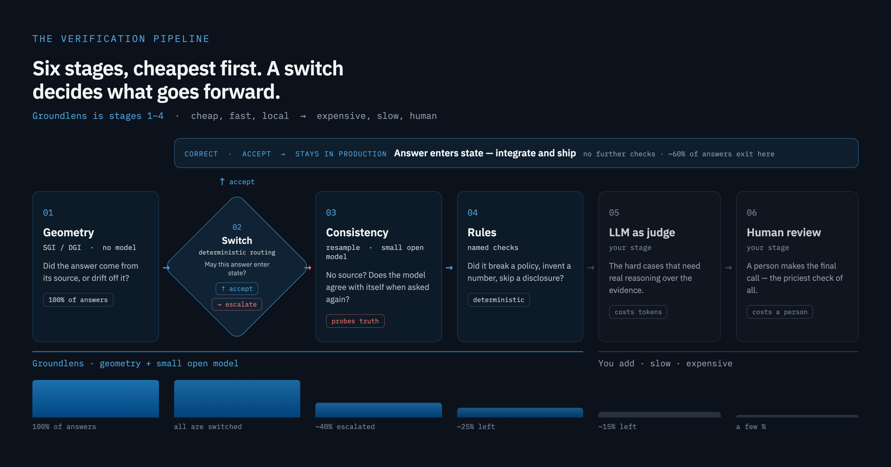

<div align="center">

# Groundlens: a set of tools for checking the output of LLMs and agents.

[](https://github.com/groundlens-dev/groundlens)
[](https://github.com/groundlens-dev/groundlens/actions)
[](https://pypi.org/project/groundlens/)
[](https://pepy.tech/project/groundlens)
[](https://www.apache.org/licenses/LICENSE-2.0)
[](https://scorecard.dev/viewer/?uri=github.com/groundlens-dev/groundlens)
[](https://docs.groundlens.dev)


You can see our live demo here:

[](https://huggingface.co/spaces/groundlens/demo)


<table><tr><td valign="top" width="20%">

### What is groundlens

[Intro](#intro)

[Tools](#tools)
    
</td><td valign="top" width="20%">

### Verificaton process

[Pipeline](#pipeline)

[Stage 1](#stage-1)
    
[Stage 2](#stage-2) 
    
[Stage 3](#stage-3) 

[Stage 4](#stage-4)
    
</td><td valign="top" width="20%">

### Groundlens features

[Calibration](#calibration) 

[Audit tools](#audit-tools)

[Agentic tools integration](#agentic-tools-integration)

[MCP Server](#mcp-server)


</td><td valign="top" width="20%">

### Research project

[Published papers](#published-papers)

[Contributing](#contributing)

</td></tr></table>

</div>

## Intro

Groundlens is a set of LLM verification methods (hallicunation detection and answer grounding checks) that includes:
- Geometric methods: SGI, which needs a source document, and DGI, which does not — as the cheap first stage of a verification pipeline. Deterministic, local, one sentence encoder, the same answer every time. It clears what it can clear and escalates the rest, because the table above is a statement about what the rest costs.
- Consistency methods: does the model agree with itself?
- Rule sets as guardrails to catch non-desired reponses.

Everything in the same pipeline. You choose what you need.

## Tools

What you can find under `pip install groundlens`

</div>

| Tool | Use it to | Call |
|---|---|---|
| **SGI** | Check an answer against the source it was given | `compute_sgi(question, context, response)` |
| **DGI** | Check an answer when there is no source. Calibrate it first | `compute_dgi(question, response)` |
| **Check** | Turn any score into a plain-language reading | `check(score)` |
| **Switch** | Decide whether an answer may be written into agent state | `GroundingSwitch().decide(score)` |
| **Consistency** | Ask the model again and measure whether it agrees with itself | `two_stage(question, answer, model=...)` |
| **Rules** | Check an answer against a written policy, with evidence | `groundlens.rules.decision_rationale_rules()` |
| **Calibrate** | Fit the cut points to your own data instead of ours | `fit_thresholds(examples)` |
| **Audit** | Keep a hash-chained trail of every check you ran | `open_log("audit.db")` |


## Pipeline

<div align="center">

</div>

AI systems verification is a pipeline with six steps are involved: from the cheapest ones to the human verification. Groundlens is stages 1 to 4. They settle what they can and pass only the doubtful cases forward, so an LLM judge or a human reviewer only ever sees what is actually in doubt.


## Stage 1

### SGI: did the answer come from the retrieved source (for examaple in RAG systems)

| Tool | Accuracy | Dataset | Need access to model internals |
|---|--:|---|---|
| Patronus Lynx 70B | 87.4% accuracy | HaluBench | No |
| GPT-4o as judge | 86.5% accuracy | HaluBench | No |
| RAG-HAT | 83.9% F1 | RAGTruth | No |
| Patronus Lynx 8B | 82.9% accuracy | HaluBench | No |
| LettuceDetect-Large | 79.2% F1 | RAGTruth | No |
| Bespoke-MiniCheck-7B | 77.4 average | LLM-AggreFact | No |
| Vectara HHEM-2.1-Open | 76.6 / 74.3 / 64.4% balanced accuracy | AggreFact-SOTA / RAGTruth-QA / RAGTruth-Summ | No |
| MiniCheck-Flan-T5-L | 75.0 average | LLM-AggreFact | No |
| Luna | 65.4% F1 | RAGTruth | No |
| GPT-4-Turbo | 63.4% F1 | RAGTruth | No |
| TruLens Groundedness | 60.4% F1 | RAGTruth | No |
| RAGAS Faithfulness | 52.0% F1 | RAGTruth | No |
| Azure AI Content Safety | No figure published | — | No |
| **SGI (Groundlens)** | **AUC 0.72–0.83** | HaluEval | **No** |

Installation:

```python
from groundlens import compute_sgi

result = compute_sgi(question=question, context=source_document, response=answer)
print(result.value, result.flagged)
```

SGI is the ratio of two angles: how far the answer sits from the question, over how far it sits from the source. High means the answer moved toward the source, which is what an answer drawn from it looks like.

| at or above 1.20 | 0.95 to 1.20 | below 0.95 |
|---|---|---|
| came from the source | partly grounded | did not come from the source |

```python
from groundlens import check, compute_sgi

result = compute_sgi(question=question, context=source_document, response=answer)
reading = check(result)
print(reading.level)      # "ok" | "review" | "risk"
print(reading.escalate)   # True for the middle band as well as the red one
print(reading.render())   # the same thing in a sentence
```

Branch on `check(result).escalate`. Branching on `result.flagged` silently passes every answer geometry could not settle.

#### What to pass as `context` when retrieval returns several chunks

Score each chunk separately and keep the best. An answer is grounded in *a* source, not in the average of five.

```python
from groundlens import compute_sgi

best = max(
    (compute_sgi(question=question, context=chunk, response=answer) for chunk in chunks),
    key=lambda r: r.value,
)
```

Concatenating the chunks moves the context embedding toward the average of several topics, which pushes `ctx_dist` up for all of them and depresses SGI even when the answer tracks one chunk exactly.


### DGI: is the answer aligned with the response (for example in one shot prompting with no document retrieval)

| Method | Accuracy | Datasets | Need access to model internals | Needs repeated sampling |
|---|--:|---|---|---|
| SelfCheckGPT-Prompt | 93.4 AUC-PR | WikiBio | No | Yes, 20 samples plus LLM calls |
| SelfCheckGPT-NLI | 92.5 AUC-PR | WikiBio | No | Yes, 20 samples |
| INSIDE / EigenScore | 0.77–0.84 AUROC | CoQA, SQuAD, NQ, TriviaQA | **Yes**, hidden states | Yes, 10 generations |
| Semantic entropy | 0.790 AUROC | 30 task and model combinations | **Yes**, log-probabilities | Yes, 10 generations |
| P(True) | 0.698 AUROC | same | **Yes** | Yes |
| Naive entropy | 0.691 AUROC | same | **Yes** | Yes |
| Embedding regression | 0.687 AUROC | same | **Yes** | No |
| **DGI (Groundlens)** | **0.62–0.90 AUROC** | RAGTruth, GL-212, TruthfulQA | **No** | **No** |

*Note: AUC-PR and AUROC are different scales. On the WikiBio set a random guess already scores 72.96 AUC-PR, while a random guess scores 0.50 AUROC.*

Installation:

```python
from groundlens import compute_dgi

result = compute_dgi(question=question, response=answer)
```

For one-shot prompting, tool use, or an agent talking to itself. DGI compares the direction from question to answer against a reference direction learned from a corpus of grounded answers.

**Calibrate it to increase detection accuracy.** DGI metric comes pre-calibrated. You can calibrate it with your own data to increase its accuracy (see [Calibrate](#calibrate--fit-the-cut-points-to-your-data). It is as easy as:

```python
from groundlens import DGI

scorer = DGI()
scorer.calibrate(pairs=my_grounded_pairs)      # list of (question, response)
result = scorer.score(question=question, response=answer)
```

## Stage 2

### Switch — may this answer enter state?

In an agent loop, one bad answer written into state contaminates every turn after it. Switch turns a score into that decision.

```python
from groundlens import GroundingSwitch, compute_sgi

score = compute_sgi(question=question, context=source_document, response=answer)
decision = GroundingSwitch(on_reject="reject").decide(score)

print(decision.write_to_state)   # may this answer enter state?
print(decision.action)           # what to do when it may not
print(decision.reason)
```

## Stage 3

### Consistency — does the model agree with itself?

```python
from groundlens.verify import two_stage

result = two_stage(question=question, answer=answer, model="Qwen/Qwen2.5-0.5B-Instruct")
print(result.escalated, result.final.render())
```

Needs `pip install "groundlens[verify]"`, which brings transformers and torch. This is the one stage that loads a generative model, and `two_stage` only reaches it when the cheap stages could not settle the answer.

When there is no source to check against, resample the model and measure agreement. This is the one stage that needs a model, and it only runs on what the earlier stages could not settle.

## Stage 4

### Rules: did it break any rule or policy I need to comply?

```python
from groundlens.rules import decision_rationale_rules

result = decision_rationale_rules(domain="finance").evaluate(
    question=question, response=answer, metadata=metadata
)
print(result.checks_passed, result.flagged)
print(result.audit_explanation)
```

Deterministic checklists for regulated settings: invented figures, missing disclosures, unsupported causal claims. Every result carries the text that triggered it.

**Rules are pattern checks, not measurements.** `checks_passed` is a weighted count of patterns that matched, not a probability of anything. Text with the right words in the right order will score well whether or not it is correct. Rules live under `groundlens.rules` rather than the top level for that reason, and the module docstring lists the four limits worth knowing before you rely on them.

## Calibration

```python
from groundlens import fit_thresholds

# one dict per answer. label 1 = ungrounded, 0 = grounded.
# context is optional and only needed if you also want an SGI cut.
examples = [
    {"question": q1, "response": r1, "label": 0, "context": src1},
    {"question": q2, "response": r2, "label": 1},
    # ... a few hundred of these
]
fit = fit_thresholds(examples)
print(fit.dgi_pass, fit.sgi_review, fit.in_sample)
```

**Label 1 means ungrounded.** Backwards does not raise, it silently fits inverted thresholds.

`fit_thresholds` moves the **cut**. `DGI().calibrate(pairs=...)` moves the **reference direction**. If DGI flags everything you write, it is the direction — a lower threshold on a compass pointing the wrong way does not help.

Our constants were fitted on our corpus. Yours will differ. A few hundred labelled answers is enough.

## Audit tools

Every entry is hashed against the one before it, so a modified record breaks the chain and `verify_chain()` says so. SQLite, local, no service.

```python
from groundlens import compute_sgi
from groundlens.audit import open_log

result = compute_sgi(question=question, context=source_document, response=answer)

with open_log("audit.db") as log:
    log.record(
        identifier="ticket-4471",
        method="sgi",
        flagged=result.flagged,
        score=result.value,
        inputs={"question": question},
    )
    print(log.verify_chain().valid)
```

## Agentic tools integration

- LangChain · LangGraph · CrewAI · Semantic Kernel · AutoGen · OpenAI · Anthropic · Gemini · Hugging Face — see [integrations](https://docs.groundlens.dev/integrations/).

## MCP Server 
YOu can use groundlens inside Claude Desktop, Cursor and Windsurf: [**groundlens-mcp**](https://github.com/groundlens-dev/groundlens-mcp).

<div align="center">
  
| Provider | Install|
|------|---------------|
| Cursor | [](https://cursor.com/install-mcp?name=groundlens&config=eyJjb21tYW5kIjoidXZ4IiwiYXJncyI6WyJncm91bmRsZW5zLW1jcCJdfQ%3D%3D)|
| VS Code | [](https://insiders.vscode.dev/redirect/mcp/install?name=groundlens&config=%7B%22command%22%3A%22uvx%22%2C%22args%22%3A%5B%22groundlens-mcp%22%5D%7D)|
| VS Code Insiders |  [](https://insiders.vscode.dev/redirect/mcp/install?name=groundlens&config=%7B%22command%22%3A%22uvx%22%2C%22args%22%3A%5B%22groundlens-mcp%22%5D%7D&quality=insiders) |
  
</div>


## Published papers

| # | Paper | ID |
|---|---|---|
| 1 | Semantic Grounding Index: Geometric Bounds on Context Engagement in RAG Systems | [arXiv:2512.13771](https://arxiv.org/abs/2512.13771) |
| 2 | A Geometric Taxonomy of Hallucination in LLMs | [arXiv:2602.13224](https://arxiv.org/abs/2602.13224) |
| 3 | How Transformers Reject Wrong Answers: Rotational Dynamics of Factual Constraint Processing | [arXiv:2603.13259](https://arxiv.org/abs/2603.13259) |
| 4 | The Outer Geometry of Truth: Register Alignment and the Limits of Embedding-Based Hallucination Detection | preprint, not yet announced |
| 5 | The Geometry of Validity: What a Reasoning Chain's Trajectory Shows That a Probe Does Not | preprint, not yet announced |

**Status.** Papers 1–3 have been peer reviewed. Papers 4 and 5 are new preprints, not yet released and not yet through a review cycle.


## Contributing

We are delighted to receive your comments or ideas and become part of this project. Also, issues and pull requests welcome. See [CONTRIBUTING.md](CONTRIBUTING.md). You can reach us directly at javier@groundlens.dev


---

## Install notes

First run downloads the default encoder, `sentence-transformers/sentence-t5-large`, about 640 MB. After that everything runs locally on CPU. `sentence-transformers` brings `torch`, so expect a large install. Smaller encoders are supported — see [installation](https://docs.groundlens.dev/getting-started/installation/).

## Privacy

Nothing leaves your machine. Scoring is local, there is no telemetry, and no text is sent anywhere. A test in the suite opens a socket monitor and fails if scoring makes a single outbound connection. See [DATA_HANDLING.md](DATA_HANDLING.md).

## How to cite

Cite the software:

```bibtex
@software{marin_groundlens,
  author  = {Marin, Javier},
  title   = {Groundlens: checks for the output of language models and agents},
  url     = {https://github.com/groundlens-dev/groundlens},
  license = {Apache-2.0}
}
```

