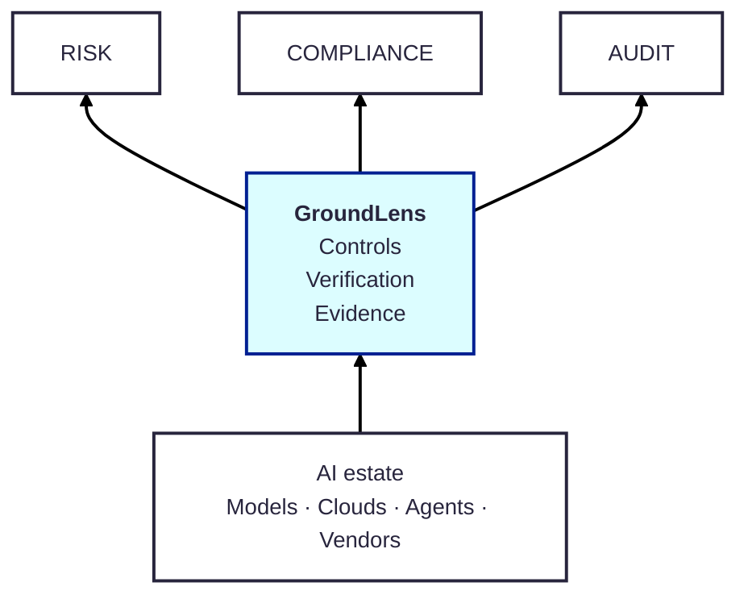

<!-- mcp-name: io.github.groundlens-dev/groundlens -->

<div align="center">


# The control and evidence layer for production AI

 ### Define a control once · Verify it across your AI estate  ·  Keep evidence that proves whether it actually operated

</div>

Your AI estate may span different models, clouds, agent frameworks and vendors. You already have observability, evaluations, cloud controls and GRC. GroundLens connects them at the point they currently leave a gap: **can you prove that the controls you defined actually operated on the AI execution?**

<div align="center">



<br>

[](LICENSE)
[](https://pypi.org/project/groundlens/)
[](https://groundlens.readthedocs.io/en/latest/)
[](https://github.com/groundlens-dev/groundlens/actions/workflows/rust.yml)
[](https://github.com/groundlens-dev/groundlens/actions/workflows/python.yml)

[](https://www.bestpractices.dev/projects/13390)
[](https://scorecard.dev/viewer/?uri=github.com/groundlens-dev/groundlens)
[](https://api.reuse.software/info/github.com/groundlens-dev/groundlens)
[](https://slsa.dev/images/gh-badge-level2.svg)

<br>

[Quick start](#quick-start) · [Why Groundlens](#why-groundlens) · [How it works](#how-it-works) · [Architecture](#architecture) · [Examples & Docs](#examples_and_docs) · [FAQ](https://github.com/groundlens-dev/groundlens/blob/main/FAQ.md)

</div>
<br>

### GroundLens is not an AI evaluation platform, an observability platform, or an AI governance system. It is the verification and evidence **layer** that sits between AI execution and those systems.

<br>

## Quick start

Install:

```bash
pip install groundlens
```

Verify a claim against evidence:

```python
from groundlens import verify

record = verify(
    "Refunds are processed in 3 days.",
    evidence=[
        (
            "kb/refunds#p2",
            "Refunds are issued within five business days.",
        )
    ],
    policy="payments_v4",
)

print(record.decision)
print(record.reasons)

record.verify()  # offline verification
```

Or from the CLI:

```bash
groundlens verify \
  --answer "Refunds are processed in 3 days." \
  --source kb/refunds#p2:"Refunds are issued within five business days."
```
A record can then be verified independently:

```bash
groundlens record verify records.jsonl
```

<br>

## Why Groundlens


| Layer | Primary question |
|---|---|
| Observability | What happened? |
| Evaluation | How well did it perform? |
| Policy / governance | What should be allowed? |
| **GroundLens** | **Can we prove the control actually operated on the execution?** |

<br>

### What you get


<div align="center">

| A common control layer | Continuous verification | Explicit coverage | Portable evidence | Independent verification |
| :------------------: | :--------------------: | :--------------: | :------------------: | :-----------------: |
| Define the business control once and apply it across different AI systems vendors and platforms | Run the control against real execution, not only against development benchmarks| Know what was verified, what was not, and where the verification boundary ends | Keep an evidence record that survives changes in models, clouds and vendors | Verify the record without trusting the service that produced it |

<br>

```text
POLICY

"Transfer requires
human approval"

▼
AI EXECUTION
┌────────────┼────────────┐
▼            ▼            ▼
tool call    approval     side effect
│            │            │
└────────────┼────────────┘
▼
GROUNDLENS
┌───────────┴───────────┐
▼                       ▼
COVERED               EXCEPTION
99.9%                   7
│                       │
└───────────┬───────────┘
▼
PORTABLE EVIDENCE
┌─────────┼─────────┐
▼         ▼         ▼
     RISK      AUDIT   COMPLIANCE
```

</div>

<br>

## How it works

- A **control** defines what must be true.

- The **capture boundary** defines which execution GroundLens can actually
observe.

- A **verifier** produces evidence. It does not claim truth.

<div align="center">

| Verifier type        | Typical property                                        |
| -------------------- | ------------------------------------------------------- |
| Numeric / rules      | Exact                                                   |
| NLI / semantic       | Reproducible under pinned artifacts                     |
| External / LLM judge | Configuration-dependent / potentially non-deterministic |

</div>

- A **policy** interprets the evidence and produces a decision.

The resulting record preserves the scope, evidence, policy, decision and integrity information needed for later review.


<br>

## Architecture

<br>

## Examples and Docs
