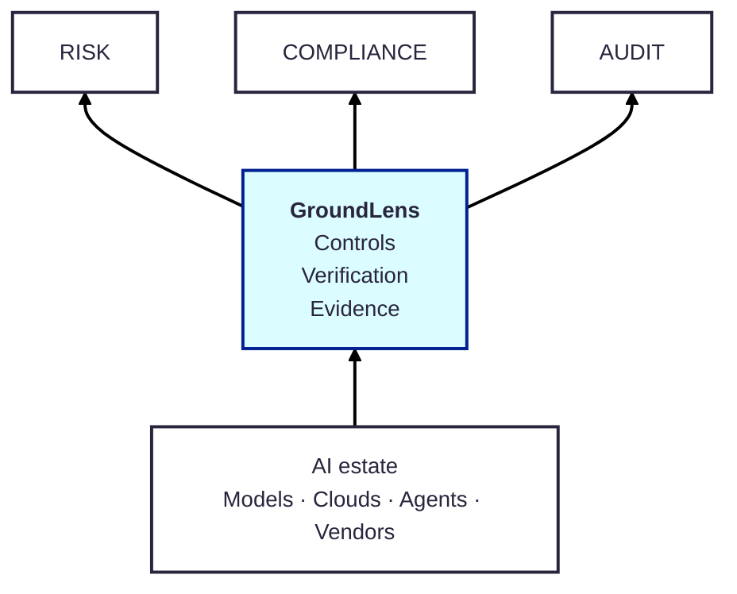

<!-- mcp-name: io.github.groundlens-dev/groundlens -->

<div align="center">


# AI control testing for production systems and agents.

### Test the controls · Gate the release · Keep the evidence

</div>

GroundLens is designed to test the controls defined for an AI system against real execution, produce explicit results, and retain portable evidence that can be reviewed and independently verified.


<div align="center">


```mermaid
---
config:
  theme: redux
  look: classic
  fontFamily: '''Open Sans Variable'', sans-serif'
  themeVariables:
    fontFamily: '''Open Sans Variable'', sans-serif'
  layout: fixed
---
flowchart BT
    A["AI estate<br>Models · Clouds · Agents · Vendors"] --> G["`**GroundLens**<br>Controls<br>Verification<br>Evidence`"]
    G --> R["RISK"] & C["COMPLIANCE"] & A2["AUDIT"]

    style G stroke:#012092,fill:#dcfdff
```

<br>

[](LICENSE)
[](https://pypi.org/project/groundlens/)
[](https://groundlens.readthedocs.io/en/latest/)
[](https://github.com/groundlens-dev/groundlens/actions/workflows/rust.yml)
[](https://github.com/groundlens-dev/groundlens/actions/workflows/python.yml)

[](https://www.bestpractices.dev/projects/13390)
[](https://scorecard.dev/viewer/?uri=github.com/groundlens-dev/groundlens)
[](https://api.reuse.software/info/github.com/groundlens-dev/groundlens)
[](https://slsa.dev/images/gh-badge-level2.svg)

<br>

[Quick start](#quick-start) · [Why Groundlens](#why-groundlens) · [How it works](#how-it-works) · [Architecture](#architecture) · [Examples and Docs](#examples-and-docs) · [FAQ](https://github.com/groundlens-dev/groundlens/blob/main/FAQ.md)

</div>
<br>

# Why GroundLens

Production AI is moving beyond a single model call. An enterprise AI estate can contain models from different providers, RAG
systems, agents, tools, internal applications, third-party AI products and systems running across different clouds and frameworks.

Organizations already have:

<div align="center">

| Existing layer | Primary question |
|:------:|:-----:|
| Observability |What happened?|
| Evaluation |How well did it perform? |
| Policy / governance |What should be allowed? |
| GRC / Risk | Which controls and risks apply?|

</div>


GroundLens is designed for the gap between:Did the control actually pass on the execution, and what evidence proves it?

```
"We have defined the control."
                 │
                 ▼
"Did the control actually operate?"
                 │
                 ▼
"Can we prove the result?"
```

What you get

One control model

Define a business control once and apply it across different AI systems,
models, clouds, frameworks and vendors.

Executable tests

Turn controls into repeatable tests against real AI execution, not only
development benchmarks.

Release gates

Use control tests as a deployment decision:

PASS    → release
REVIEW  → human decision
FAIL    → block / remediate

Explicit coverage

Know what was tested, what was not, and where the verification boundary ends.

Portable evidence

Keep a record of the test, execution, evidence, policy and decision that can
survive changes in the underlying AI platform.

Independent verification

Verify the resulting record without relying on a permanent GroundLens service.

In one picture

flowchart LR
    A["AI estate<br/>Models · RAG · Agents · Tools · Vendors"]
    B["GROUNDLENS<br/><br/>Control tests<br/>Execution capture<br/>Verification<br/>Evidence"]
    C["Release"]
    D["Risk / Compliance"]
    E["Audit"]

    A --> B
    B --> C
    B --> D
    B --> E

GroundLens is not another AI evaluation platform, observability platform or
GRC system.

It is the control-testing and evidence layer that works across them.

2. Quick start

The developer experience is designed to be simple:

pip install groundlens

Run a control test

from groundlens import verify

record = verify(
    "Refunds are processed in 3 days.",
    evidence=[
        (
            "kb/refunds#p2",
            "Refunds are issued within five business days.",
        )
    ],
    policy="payments_v4",
)

print(record.decision)
print(record.reasons)

# Verify the sealed record offline.
record.verify()

From the CLI:

groundlens verify \
  --answer "Refunds are processed in 3 days." \
  --source kb/refunds#p2:"Refunds are issued within five business days."

Verify a stored record later:

groundlens record verify records.jsonl

The same core contract is intended to be available through:

Python SDK
CLI
execution runtime
MCP
policy engine
verification libraries
portable evidence records

3. How GroundLens works

A GroundLens control test follows one path:

flowchart LR
    A["CONTROL"] --> B["SCOPE"]
    B --> C["CAPTURE"]
    C --> D["VERIFY"]
    D --> E["EVIDENCE"]
    E --> F["POLICY"]
    F --> G["DECISION"]
    G --> H["ASSURANCE RECORD"]

Control

A control defines what the AI system is required to satisfy.

Examples:

"Customer-facing answers must be supported by approved sources."

"Transfers require human approval."

"Only approved tools may be called."

"Sensitive data must remain inside the defined boundary."

"Changes to permissions require re-verification."

A control is a business or technical requirement that can be turned into one or
more executable tests.

Scope

Scope defines what the test claims to cover.

A record should be able to say:

what was in scope
what was tested
what was not tested
what could not be observed

A signed record must not imply more coverage than actually existed.

Capture

Capture defines how the AI execution entered the test.

Possible modes include:

supplied trace
instrumented execution
inline capture
gateway / enforced path

These modes provide different assurance boundaries.

GroundLens must never turn:

"We tested the trace we received."

into:

"We tested everything the system did."

Verify

A verifier checks an execution or part of an execution.

Examples:

numeric
rules
lexical
NLI / entailment
semantic similarity
permission checks
custom domain verifiers
external detectors
LLM-based judges

A verifier produces evidence, not truth.

Evidence

Evidence describes what a verifier found and how it produced the result.

A result can contain:

verifier
version
model / artifact
configuration
execution reference
result
score where meaningful
confidence where meaningful
source / answer spans
timestamp
calibration

The evidence remains tied to the verifier that produced it.

Policy

A policy determines how evidence becomes a decision.

For example:

policy: payments_v4

rules:
  - when: missing_human_approval
    decision: FAIL

  - when: unsupported_financial_claim
    decision: REVIEW

  - when: required_controls_pass
    decision: PASS

Decision

The standard decision model is:

PASS
REVIEW
FAIL

A deployment or operational workflow can map those outcomes to its own actions:

PASS    → release
REVIEW  → human approval
FAIL    → block / remediate

Assurance record

The assurance record preserves:

control
scope
capture mode
execution reference
verifiers
evidence
policy
decision
integrity information

The record is designed to be portable and independently verifiable.

4. Product model and architecture

GroundLens is designed as a test system first, with the surrounding assurance
capabilities growing around the same test contract.

A control test is the basic unit

The core unit is not a score.

It is:

CONTROL
   +
EXECUTION
   ↓
TEST
   ↓
EVIDENCE
   ↓
DECISION
   ↓
RECORD

For example:

Control:
    REFUND_REQUIRES_HUMAN_APPROVAL

Execution:
    agent requested refund €1,850

Test:
    approval present?

Evidence:
    approval = missing

Policy:
    missing_human_approval -> FAIL

Decision:
    FAIL

Record:
    signed · scoped · independently verifiable

Multiple controls can test one system

flowchart TB
    A["AI Agent"] --> B["GroundLens"]

    B --> C["Grounding test"]
    B --> D["Tool permission test"]
    B --> E["Human approval test"]
    B --> F["PII boundary test"]
    B --> G["Traceability test"]

    C --> H["Control results"]
    D --> H
    E --> H
    F --> H
    G --> H

    H --> I["Release / Review / Fail"]
    H --> J["Evidence package"]

The same controls can test many systems

                    CONTROL
                       │
        ┌──────────────┼──────────────┐
        ▼              ▼              ▼
     Agent A        RAG App        Vendor AI
        │              │              │
        └──────────────┼──────────────┘
                       ▼
             common test semantics
                       │
                       ▼
                comparable evidence

This is the reason for a vendor-neutral control layer.

Release testing

The first operational use of GroundLens can be a release gate.

AI SYSTEM
    │
    ▼
CONTROL TEST SUITE
    │
    ├── grounding .............. PASS
    ├── tool permissions ....... PASS
    ├── human approval ......... PASS
    ├── sensitive-data boundary  PASS
    └── side-effect policy ..... REVIEW
                         │
                         ▼
                    RELEASE GATE
                         │
                 ┌───────┴───────┐
                 ▼               ▼
              RELEASE           REVIEW

This makes GroundLens familiar to developers:

an AI control test suite that can gate a release.

Continuous testing

The same control tests can move from pre-production to production:

design
  ↓
pre-production tests
  ↓
release gate
  ↓
production execution
  ↓
continuous control testing
  ↓
exception
  ↓
re-verification

A model, prompt, tool, permission or orchestration change can trigger targeted
re-testing.

The objective is not to retest everything whenever anything changes.

The objective is to re-test the controls affected by the change.

Enforcement

Testing and enforcement are related but distinct.

A test can produce:

PASS
REVIEW
FAIL

An enforcement path can turn that result into:

PASS    → allow action
REVIEW  → hold / request approval
FAIL    → block action

This allows the same control definition to move from:

test

to:

gate

to:

runtime enforcement

without changing its business meaning.

Evidence is the hand-off to the rest of the organization

The developer needs the test result.

Risk and Compliance need the control result and exceptions.

Audit needs the underlying evidence and scope.

GroundLens is designed so that all three can refer to the same artifact.

developer
    │
    │ runs / fixes tests
    ▼
GroundLens
    │
    │ produces evidence
    ▼
risk / compliance / audit

The developer should not need to implement a GRC platform.

The risk team should not need to understand the internals of every AI system.

5. Examples, boundaries and design principles

Example: grounded answers

Control:

CUSTOMER_ANSWER_MUST_BE_GROUNDED

Execution:

Answer:
"Refunds are processed in 3 days."

Source:
"Refunds are issued within five business days."

Result:

decision   FAIL
evidence   contradiction / unsupported claim
scope      1/1 claims tested

The test produces evidence that can be inspected and retained.

Example: agent action

Control:

REFUND_REQUIRES_HUMAN_APPROVAL

Execution:

customer.read
refund.create
human.approval = missing

Result:

decision   FAIL

evidence
  customer.read       allowed
  refund.create       requested
  approval            missing

scope
  3/3 relevant events covered

The same control can later become an enforcement rule:

missing_human_approval -> BLOCK

What GroundLens does not claim

GroundLens does not turn a weak verifier into a strong assurance claim.

A signed record proves the integrity of the record.

It does not prove that:

the verifier was objectively correct;

an event outside the declared capture boundary did not occur;

the AI system is generally safe;

the organization is legally compliant.

Those are separate questions.

Independent verification

The target architecture is:

GroundLens record
      │
      ├── GroundLens CLI
      ├── GroundLens library
      └── independent implementation

The record should be checkable without requiring a permanent GroundLens
service.

Local-first

The verification core is designed to run locally.

Target properties include:

No telemetry
No SaaS dependency for verification
Offline verification
Signed records
Append-only history
Explicit execution boundaries

Vendor-neutral

GroundLens is designed to operate across:

model providers
clouds
agent frameworks
application frameworks
third-party AI systems
internal AI systems

The AI platform runs the system.

GroundLens tests the controls applied to its execution.

