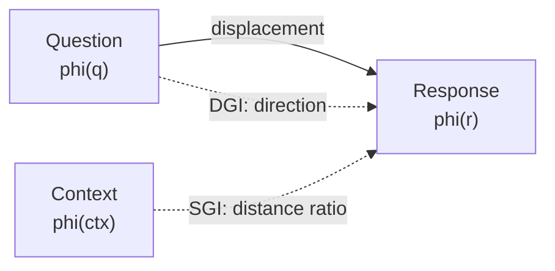
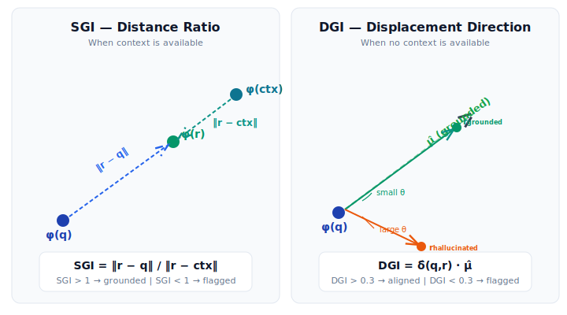

# How It Works

groundlens triages LLM outputs by analyzing the **geometry** of text embeddings. Before spending a second LLM (or a human) on "is this answer correct?", groundlens computes a deterministic geometric score that filters out the responses not even engaging their source, so the expensive second-stage check runs on far fewer outputs.

## The Core Idea

Every piece of text --- a question, a context document, an LLM response --- can be mapped to a point in a high-dimensional vector space using a sentence transformer. In this space, texts with similar meaning are close together; texts with different meaning are far apart.

groundlens exploits two geometric properties of this space:

1. **Distance ratios** (SGI): If a response truly engaged with the source context, it should be geometrically closer to that context than to the bare question.
2. **Displacement directions** (DGI): Grounded responses create a characteristic "direction of movement" from question to answer. Hallucinations move in different directions.

## The Embedding Space

groundlens uses sentence transformers (default: `all-MiniLM-L6-v2`) to map text into $\mathbb{R}^{384}$. In this space:

- Each text becomes a 384-dimensional vector
- Semantic similarity correlates with geometric proximity
- The space has rich structure: clusters for topics, gradients for specificity, and characteristic directions for question-answer relationships

!!! info "Why sentence transformers?"
    Sentence transformers are specifically trained (via contrastive learning) to place semantically similar texts nearby and dissimilar texts far apart. This is exactly the property groundlens needs --- the geometric structure encodes semantic relationships.

<figure>
  
  <figcaption>The two scoring methods: SGI compares how close the response is to the context versus the question; DGI checks whether the displacement from question to response aligns with a learned "grounded direction" μ̂.</figcaption>
</figure>

## SGI: Distance Ratios

When context is available, SGI asks: **is the response closer to the context or to the question?**

$$
\text{SGI} = \frac{\|\phi(r) - \phi(q)\|}{\|\phi(r) - \phi(\text{ctx})\|}
$$

- If SGI > 1, the response is closer to the context (grounded)
- If SGI < 1, the response is closer to the question (possibly ignoring context)

This captures a fundamental intuition: a grounded response should semantically resemble the source material more than it resembles the question that prompted it.

## DGI: Displacement Directions

When no context is available, DGI analyzes the **direction** of semantic movement from question to response:

$$
\delta = \phi(r) - \phi(q), \quad \text{DGI} = \frac{\delta}{\|\delta\|} \cdot \hat{\mu}
$$

where $\hat{\mu}$ is a reference direction learned from verified grounded (question, response) pairs.

The insight: grounded responses tend to move in a consistent direction in embedding space (toward factual elaboration). Hallucinations move in different, less consistent directions.

## Normalization

Raw scores are normalized to [0, 1] for convenience:

| Method | Raw range | Normalization | Mapping |
|---|---|---|---|
| SGI | [0, +inf) | $\tanh(\max(0, \text{SGI} - 0.3))$ | Sigmoid-like curve |
| DGI | [-1, 1] | $(\text{DGI} + 1) / 2$ | Linear mapping |

## Thresholds

groundlens uses empirically-derived thresholds to flag responses:

| Threshold | Value | Meaning |
|---|---|---|
| `SGI_STRONG_PASS` | 1.20 | Strong context engagement |
| `SGI_REVIEW` | 0.95 | Below this: flagged for review |
| `DGI_PASS` | 0.30 | Above this: aligned with grounded patterns |

!!! warning "Thresholds are for triage, not for truth"
    groundlens scores are verification triage signals --- they help you prioritize which outputs need human review. A high score does not guarantee factual accuracy; a low score does not guarantee hallucination. The value is in **efficiently directing human attention** to the outputs most likely to need it.

## What groundlens Cannot Do

- **Verify factual truth**: groundlens measures geometric properties of embeddings, not correspondence to external reality. See the [Hallucination Taxonomy](../theory/hallucination-taxonomy.md) for which types of errors are detectable and which are not.
- **Detect within-frame factual errors (Type III)**: When the wrong answer shares vocabulary and structure with the correct answer, no embedding-based method can distinguish them. See [Confabulation Boundary](../theory/confabulation-boundary.md).
- **Replace human review**: groundlens is a triage tool. It tells you *where to look*, not *what is true*.

## Next Steps

- [SGI Deep Dive](sgi.md) --- formula, thresholds, geometric interpretation
- [DGI Deep Dive](dgi.md) --- reference direction, calibration, von Mises-Fisher
- [Embedding Geometry Theory](../theory/embedding-geometry.md) --- the mathematics behind the embeddings
