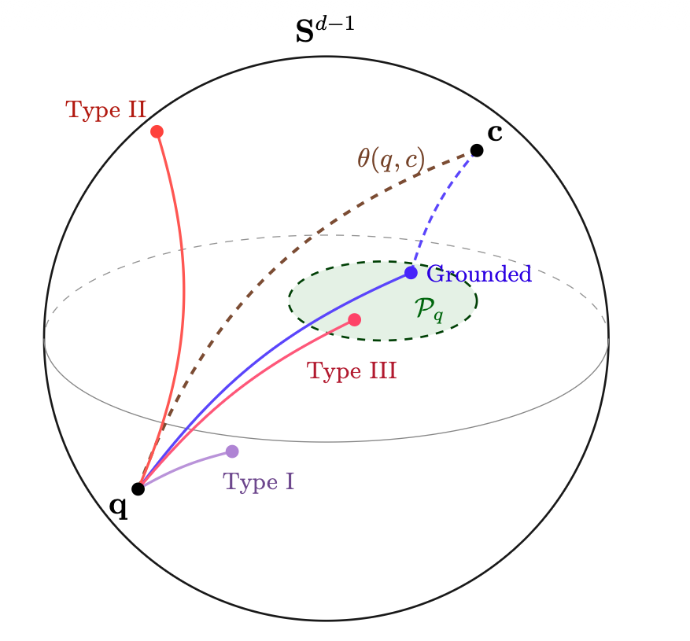

# A Geometric Taxonomy of LLM Hallucinations

Not all hallucinations are the same. A response that ignores its source document, a response that invents a fictional institution, and a response that swaps "Sydney" for "Canberra" are three different failures — and they require different detection strategies.

groundlens is built on a geometric taxonomy that classifies hallucinations by their **relation to the plausibility region** of grounded responses in embedding space. The taxonomy determines which types are detectable by angular geometry and which are not — and the predictions hold empirically.

**Paper:** Marin, J. (2026). *A Geometric Taxonomy of Hallucination in Large Language Models.* [arXiv:2602.13224](https://arxiv.org/pdf/2602.13224v3)

---

<figure>
  
  <figcaption>The three hallucination types on the unit hypersphere Sd−1. Grounded responses fall inside the plausibility region 𝒫q. Type I (unfaithfulness) stays near the question; Type II (confabulation) deviates from the grounded displacement direction; Type III (within-frame error) lands inside 𝒫q and is geometrically indistinguishable from a correct answer.</figcaption>
</figure>

## The three types

### Type I — Unfaithfulness (query-proximate)

**What happens:** The response ignores the provided source context and stays anchored to the question. In a RAG system, this means the model answered from parametric memory instead of from the retrieved document.

**Geometric signature:** The response embedding is closer to the question than to the context on the unit hypersphere:

$$
\theta(r, q) < \theta(r, c) \implies \text{SGI} < 1
$$

**Detection:** SGI measures this directly. On HaluEval QA ($n = 10{,}000$), SGI achieves AUROC **0.805** across five embedding architectures — cross-model Pearson correlation of per-instance scores averages $r = 0.85$, confirming SGI measures a property of the text, not an artifact of any single embedding.

| Method | AUROC on HaluEval QA |
|---|---|
| Cosine similarity | 0.941 |
| SGI (mean of 5 models) | 0.805 |
| NLI (DeBERTa-v3-small) | 0.748 |

Cosine alone reaches 0.941 because HaluEval hallucinations diverge far enough that surface proximity suffices. SGI is lower but provides what the others cannot: a ratio that directly diagnoses *whether* the response drew from context or defaulted to the query.

!!! note "Scoping"
    Type I as defined here captures the *query-proximate* variant of unfaithfulness — responses whose embeddings default to the query's semantic neighborhood. Other modes of unfaithfulness (off-topic continuations, parametric memory from a different domain) produce different geometry and lie outside the scope of SGI. For those, source-grounded methods such as AlignScore are more appropriate.

---

### Type II — Confabulation

**What happens:** The response invents content that falls *outside* the plausibility region of the query — fabricated institutions, redefined technical terms, mechanisms imported from adjacent domains.

**Geometric signature:** The displacement vector from question to response deviates from the mean grounding direction $\hat{\mu}$ learned from verified (question, response) pairs:

$$
\Gamma(q, r) = \hat{\delta}(q, r)^\top \hat{\mu} \ll \mathbb{E}[\hat{\delta}_i^\top \hat{\mu}]
$$

**Detection:** DGI separates this **while the confabulation stays out of register**. As it moves into register, DGI declines toward chance like every embedding-similarity method: with authorship held constant it reaches AUROC 0.606, and ≈ 0.68 is the ceiling of the whole class. Escalate the in-register cases.

#### Three confabulation mechanisms

The taxonomy identifies three mechanisms of confabulation, each with a different geometric consequence. These map directly to patterns observed in clinical neuropsychology, where confabulation from incomplete memory produces different failures depending on what kind of knowledge is being recalled (Dalla Barba, 1993).

**Register preservation** (regulatory/procedural domains): The confabulation inverts factual claims while keeping the domain register intact. Example: asked about Roth IRA contribution rules, a confabulation fabricates a flat 15% withdrawal tax and invents mandatory distributions at 65 — but every term (*contributions, distributions, adjusted gross income*) stays in the financial-regulatory register. Because the wrong answer shares the same lexical distribution as the right one, the embedding displacement is small. Detection difficulty: **high**.

**Template-filling** (technical specification domains): The confabulation preserves the syntactic template (entity → classification → mechanism → interaction) while swapping content in the slots. Example: asked about SQL `GROUP BY`, a confabulation describes parallel query partitioning rather than row aggregation — but the clause-mechanism-usage template is identical. The template dominates the embedding; the slot content where truth resides contributes little variance. Detection difficulty: **high** — template-structured domains (Python, TypeScript) reach only 56.9% detection, not significantly above chance ($p = .161$).

**Mechanism inversion** (declarative-knowledge domains): The confabulation preserves the broad subject register but invents a mechanism drawn from an adjacent domain, importing vocabulary from that neighboring register. Example: asked how CRISPR-Cas9 edits genes, a confabulation describes protein-folding correction rather than DNA cleavage, importing *chaperones, mRNA, refolding* from a neighboring molecular-biology register. The imported vocabulary creates distributional divergence that DGI can detect **while the import stays out of register**. Detection difficulty rises steeply as the confabulation stays inside the domain's own register, and the previously reported 87.8% detection figure is withdrawn: it came from a benchmark where the grounded and confabulated text had different authors.

!!! info "The template vs. declarative split"
    Fisher's exact test confirms the split between template-structured and declarative domains at $p = 1.5 \times 10^{-6}$, replicating across all four embedding architectures tested. This split is itself a prediction of the taxonomy: confabulations that stay within their domain register approach the Type III boundary in detection difficulty.

---

### Type III — Factual error within frame

**What happens:** The response uses the correct vocabulary, named entities, and syntactic frame — but gets the facts wrong. The wrong answer and the correct answer are distributionally indistinguishable.

**Geometric signature:** None. Both responses cluster in the same region of embedding space:

$$
\hat{\phi}(r_{\text{wrong}}) \in \mathcal{P}_q \quad \text{and} \quad \hat{\phi}(r_{\text{correct}}) \in \mathcal{P}_q
$$

**Example:** For the question *"What is the capital of Australia?"*, the embeddings of *"Sydney"* and *"Canberra"* as responses are statistically indistinguishable — both share the syntactic frame, topical register, and named-entity scaffolding of the question. The alignment objective of contrastive training pulls them into the same neighborhood regardless of which one is true.

**Detection:** Not possible by angular geometry. On TruthfulQA (817 matched pairs):

| Method | AUROC | Interpretation |
|---|---|---|
| Cosine similarity | 0.365 | **Inverted** — favors false answers |
| $\Gamma$ (5-fold CV) | 0.535 | Chance — no signal |
| $\Gamma$ (global) | 0.579 | Slight leakage from $\hat{\mu}$ estimation |
| NLI (DeBERTa-v3-small), on this dataset | 0.311 | Below chance **on TruthfulQA specifically** |

The geometric scores sit at chance here, and that is the Type III boundary: on a same-frame factual error, angular geometry has nothing to measure.

!!! warning "Do not generalize the NLI number on this dataset"
    An earlier version of this page read the 0.311 as evidence that entailment classifiers "invert" and that *any* method using distributional features of the (question, response) pair inherits the problem. **That generalization is wrong, and it was the most damaging claim in these docs**, because it argued the reader out of the one method that works.

    TruthfulQA is an adversarial misconception benchmark with a length and hedging artifact: false answers are short, confident misconceptions; true answers are long and hedged. It punishes a classifier reading surface confidence. It says nothing about entailment in general.

    Measured properly, binned by how far a confabulation sits from the register of a correct answer, an NLI cross-encoder holds AUROC 0.836, 0.786, 0.837, 0.719, **0.887**, and it **does not decline**. It is the strongest method precisely where geometry dies. Entailment is the recommended second stage. See [Results](../benchmarks/results.md).

---

## The alignment objective: why the taxonomy works

The taxonomy is not arbitrary. It follows from a single property of how contrastive sentence encoders are trained.

The alignment objective (Wang & Isola, 2020) optimizes angular relationships on the unit hypersphere by pulling semantically related pairs together as a function of distributional similarity — shared vocabulary, co-occurrence statistics, syntactic patterns. Crucially, **it does not encode truth value**. Two responses sharing vocabulary, named entities, and syntactic frame cluster on the sphere whether they are correct or not.

This single property determines:

- **Type I is detectable** because an unfaithful response *doesn't engage with the context*, producing a measurable angular asymmetry (SGI < 1).
- **Type II is detectable** because confabulation *imports vocabulary from outside the plausibility region*, creating distributional divergence that displaces the response away from the grounded direction.
- **Type III is undetectable** because the wrong answer *shares the distributional properties of the correct answer*, and the alignment objective clusters them together regardless of truth.

---

## Benchmark transfer gap

A critical finding: **detection performance measured on LLM-generated benchmarks does not transfer to human-written confabulations.**

| Condition | Detection rate | Paired cosine similarity |
|---|---|---|
| HaluEval (LLM-prompted fabrication) | 88–97% | 0.10–0.78 |
| LLM confabulations (same questions) | 73–76% | 0.86–0.96 |
| Human confabulations (same questions) | 69–78% | 0.72–0.92 |

The cause is visible in the paired similarity column: HaluEval's correct and hallucinated responses sit far apart in embedding space, while human confabulations remain close to their grounded counterparts. A method scoring 95% on HaluEval is detecting the *distributional trace of LLM-prompted fabrication* — the instruction to "generate a wrong answer" leaves a geometric fingerprint that is not present in production hallucinations.

Human confabulations, produced via provoked confabulation (asking a person a question they cannot answer from knowledge), generate false content from incomplete memory rather than from instruction. The resulting text is well-formed, topically appropriate, and entailment-compatible — which is precisely what makes it dangerous in deployment.

---

## External validation

The taxonomy's predictions hold on independently collected, human-annotated benchmarks:

**ExpertQA** (900 expert-annotated claims, 32 specialist fields): an earlier version of this page reported that $\Gamma$ outperformed NLI by $\Delta = +0.243$. That comparison ran without an authorship or length control and is **withdrawn**. Detectors that appear to beat entailment on this class are, on inspection, reading who wrote the text: hold authorship constant and a supervised probe over the same embeddings falls from 0.932 to 0.660.

**WikiBio GPT-3** (102 sentence-level annotations): NLI outperforms $\Gamma$ by $\Delta = +0.131$. The annotation criterion marks any incorrect detail as "major inaccurate" regardless of semantic distance, conflating Type II (large displacement) and Type III (near-zero displacement). When a dataset mixes the two types, $\Gamma$ detects only the Type II subset.

**FELM** (81 segment-level labels): Both methods perform similarly.

The pattern is itself a prediction: $\Gamma$ wins when errors are predominantly Type II; it loses when datasets mix Types II and III.

---

## Practical implications

### What groundlens can and cannot detect

| Hallucination type | Detection | Typical AUROC |
|---|---|---|
| Context-ignoring responses (Type I) | **Strong** — SGI | 0.80–0.95 |
| Mechanism inversion confabulations (Type II) | **Strong** — DGI | 0.85–0.99 |
| Topic drift / irrelevant responses (Type II) | **Strong** — DGI | 0.85–0.95 |
| Template-filling confabulations (Type II/III boundary) | **Weak** — DGI | 0.50–0.60 |
| Within-frame factual errors (Type III) | **None** | ~0.50 |

### Deployment guidance

1. **groundlens is verification triage, not a truth oracle.** It catches the hallucination types that leave geometric traces — which are the most common and most damaging in production. It cannot verify factual correctness at the individual claim level.

2. **The value is in what you don't need to review.** If groundlens passes 80% of outputs and flags 20%, and the flagged set contains 95% of the actual hallucinations, you have reduced your human review workload by 4x while catching nearly all problems.

3. **Complement with domain knowledge.** For high-stakes applications where within-frame factual errors matter (medical, legal, financial), combine groundlens triage with domain-specific fact-checking on the outputs that pass geometric verification. See [Complementary Tools for Type III Detection](confabulation-boundary.md#complementary-tools-for-type-iii-detection) for concrete tool recommendations.

4. **Calibrate per domain, to set your escalation rate.** Calibration moves the operating point, not the wall: overall AUROC 0.684 → 0.736, with the gain at the easy out-of-register end (0.717 → 0.815) and the in-register bin moving only 0.626 → 0.689. Calibration decides how much you send to the second stage. It does not decide what you can see.

5. **Be honest about benchmark results.** Performance on LLM-generated benchmarks (HaluEval, HaluBench) overstates what any method — geometric, NLI, or otherwise — achieves on the hallucinations deployed systems actually produce.

---

## Addressing the research review process

The taxonomy paper was submitted to ACL ARR and received detailed reviewer feedback. The revision addressed every concern. The key improvements are documented here for transparency:

### Baselines and comparisons

The original submission reported only groundlens metrics. The revision adds NLI (cross-encoder/nli-deberta-v3-small) and cosine similarity as baselines in every results table. Cosine reaches 0.941 on HaluEval QA — higher than SGI (0.805). This is discussed honestly: HaluEval hallucinations diverge enough that surface proximity suffices. SGI's value is the diagnostic ratio, not raw discrimination.

White-box methods (hidden-state trajectories), multi-sample methods (SelfCheckGPT, semantic entropy), and source-grounded methods (AlignScore on context-free experiments) are excluded from comparison with explicit justification: different access model, different cost profile, or different input requirements.

### Positioning relative to concurrent work

Five concurrent geometric detection methods are distinguished by level of analysis, access model, and theoretical basis:

- **Korún (2026):** Token-level cluster topology inside transformer encoders/decoders — different level of analysis
- **Mir et al. (2025, LSD):** Hidden-state trajectories across transformer layers — requires white-box access
- **Phillips et al. (2025):** Archetypal analysis on batched responses — sampling-based
- **Çatak et al. (2024):** Convex-hull analysis on response embeddings
- **Huang (2026):** Geodesic training constraints — same geometric primitive but orthogonal purpose (training vs. evaluation)

groundlens differs in three ways: (1) sentence-level rather than token-cluster or hidden-state level; (2) black-box, single-pass; (3) predictions grounded in the alignment objective.

### Type II/III distinction

The distinction is not ontological but operational: it is motivated by what detection methods can and cannot see. The template-versus-declarative split ($p = 1.5 \times 10^{-6}$) provides direct empirical evidence. Formal definitions with explicit mathematical notation replace the informal descriptions of the original.

### TruthfulQA methodology

Two configurations differentiate genuine signal from leakage: global $\Gamma$ (computes $\hat{\mu}$ over all truthful answers) vs. 5-fold CV $\Gamma$ (computes $\hat{\mu}$ on 80%, evaluates on 20%). The gap (0.579 vs. 0.535) measures how much apparent performance is leakage from the truthful answer set rather than actual factual-error detection.

### Dataset methodology

The human-confabulated dataset uses provoked confabulation (Berlyne, 1972; Moscovitch, 1995): asking questions to someone who cannot answer from knowledge. The dataset grew from 142 to 212 pairs across nine domains. Length matching (grounded $\mu = 55.6$ words, confabulated $\mu = 57.3$) prevents length from becoming a detection shortcut. The single-confabulator limitation is stated explicitly — scaling to multiple generators across languages is the most important next step.

---

## References

- Marin, J. (2026). *A Geometric Taxonomy of Hallucination in Large Language Models.* [arXiv:2602.13224](https://arxiv.org/pdf/2602.13224v3)
- Marin, J. (2025). *Semantic Grounding Index for LLM Hallucination Detection.* [arXiv:2512.13771](https://arxiv.org/abs/2512.13771)
- Marin, J. (2026). *Rotational Dynamics of Factual Constraint Processing in LLMs.* [arXiv:2603.13259](https://arxiv.org/abs/2603.13259)
- Wang, T. & Isola, P. (2020). Understanding contrastive representation learning through alignment and uniformity on the hypersphere. *ICML*.
- Dalla Barba, G. (1993). Different patterns of confabulation. *Cortex*, 29(4), 567–581.
- Lin, S. et al. (2022). TruthfulQA: Measuring how models mimic human falsehoods. *ACL*.
- Li, J. et al. (2023). HaluEval: A large-scale hallucination evaluation benchmark. *EMNLP*.
- Malaviya, C. et al. (2024). ExpertQA: Expert-curated questions and attributed answers. *NAACL*.
