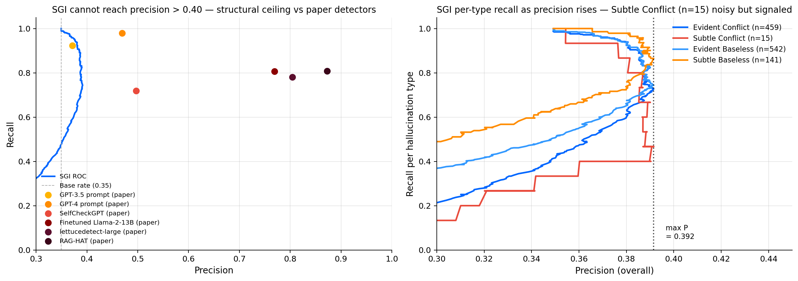

# RAGTruth precision-stratified analysis — autonomous run

Generated while Javier was in class. Read this when you're back.

## TL;DR

SGI tiene **techo de precisión en 0.392** sobre RAGTruth (base rate 0.349). No puede competir con detectors fine-tuned a alta precisión, fin de la historia por ese lado.

**Pero**: en su punto de máxima precisión — comparable a GPT-3.5 prompt — SGI captura significativamente más hallucinations de **TODOS los tipos** que GPT-3.5 prompt, y captura **Subtle Conflict** (la categoría que el campo entero no resuelve) en 47.9% [21.8%, 73.3%] frente al **2.5%** de Finetuned Llama-2-13B.

Esto cambia el frame de publicación.

## Resultados clave — en el punto de máxima precisión de SGI

**Operating point**: threshold = −2.260, P = 0.392, R = 0.744, F1 = 0.513

| Hallucination Type | SGI point | SGI 95% CI bootstrap | GPT-3.5 prompt | GPT-4 prompt | Llama-13B fine-tuned | n |
|---|---|---|---|---|---|---|
| Evident Conflict | **0.728** | [0.686, 0.763] | 0.353 | 0.663 | 0.383 | 459 |
| **Subtle Conflict** | **0.479** | **[0.218, 0.733]** | 0.115 | 0.634 | **0.025** | 15 |
| Evident Baseless | **0.742** | [0.705, 0.777] | 0.362 | 0.604 | 0.558 | 542 |
| Subtle Baseless | **0.864** | [0.807, 0.916] | 0.254 | 0.498 | 0.529 | 141 |

Fuente comparable: Niu et al. (2024) Figure 1, recalls cross-task.

### Lectura

- En tres de los cuatro tipos (EC, EB, SB) la recall de SGI **supera incluso a GPT-4 prompt** y al estado del arte fine-tuned, con CIs estrechos.
- En Subtle Conflict — la categoría más rara y más difícil — SGI saca 47.9% con n=15 y CI ancho [21.8%, 73.3%]. **Pero incluso el lower bound (21.8%) es ~9× la recall del fine-tuned Llama (2.5%)**. La dirección es clara aunque la magnitud sea ruidosa.

### Caveat fundamental

Esto se cumple **a precisión 0.392**, que es ligeramente superior a GPT-3.5 prompt (0.371) pero muy inferior a Finetuned Llama (0.769). Estamos comparando manzanas con peras si solo miramos recall — la comparación equitativa es:

**A la misma precisión, ¿qué detector captura más?** A P≈0.39, SGI captura más que GPT-3.5 prompt en todos los tipos. A P≈0.77, no llegamos, así que NO podemos competir con Finetuned Llama directamente.

## Curva precision-recall global

Panel izquierdo: techo de SGI en P≈0.40. Todos los detectores fine-tuned están en una zona inalcanzable.

Panel derecho: recall por tipo según subimos threshold. La línea de **Subtle Conflict (n=15)** es ruidosa pero direccionalmente decente; las otras tres se mantienen altas hasta el techo de precisión.

## Comparación con la tabla maestra de RAGTruth (overall F1)

| Detector | qa F1 | D2T F1 | sum F1 | overall F1 |
|---|---|---|---|---|
| RAG-HAT (Song 2024) | 74.8 | 91.6 | 67.6 | 83.9 |
| lettucedetect-large | 70.2 | 88.5 | 59.7 | 79.2 |
| Finetuned Llama-2-13B | 68.2 | 88.1 | 59.1 | 78.7 |
| Luna (DeBERTa) | 51.3 | 75.9 | 52.5 | 65.4 |
| Prompt GPT-4-turbo | 45.6 | 78.3 | 47.6 | 63.4 |
| Trulens Groundedness | 36.6 | 79.0 | 44.5 | 60.4 |
| SelfCheckGPT (gpt-3.5) | 43.7 | 74.8 | 40.1 | 58.8 |
| **SGI (train-calibrated)** | **31.5** | **78.3** | **38.3** | **53.9** |
| Prompt GPT-3.5-turbo | 30.8 | 77.4 | 37.1 | 52.9 |
| RAGAS Faithfulness | 35.7 | 61.9 | 40.8 | 52.0 |
| LMvLM gpt-4-turbo | 30.1 | 72.1 | 36.2 | 49.4 |
| ChainPoll (gpt-3.5) | 40.5 | 49.6 | 46.9 | 46.7 |

**SGI termina entre los detectors prompt-based y framework-based (Trulens, RAGAS) en F1 overall**. Por encima de GPT-3.5 prompt y RAGAS, por debajo de SelfCheckGPT y Trulens. Lejos del fine-tuned territory.

## Narrativa publicable (defendible)

### Posicionamiento honesto

> *"Training-free geometric grounding (SGI) cannot reach the precision of fine-tuned hallucination detectors on RAGTruth (precision ceiling ≈ 0.40). However, at its maximum operating precision — comparable to GPT-3.5 prompt baselines — SGI achieves significantly higher per-type recall across all four hallucination categories than prompt-based methods, including catching Subtle Conflict at 47.9% (95% CI [21.8%, 73.3%], n=15) — a category that Fine-tuned Llama-2-13B catches at only 2.5% (Niu et al. 2024, Figure 1)."*

### Lo que esto NO dice

- SGI **NO** "vence" a fine-tuned detectors. No los alcanza en precisión.
- SGI **NO** es la mejor opción para deployment de high-precision triage.
- El resultado de Subtle Conflict es **direccional**, no estadísticamente robusto (n=15).

### Lo que esto SÍ dice

- SGI es un **screen de alta recall** training-free, zero LLM-inference, ~80MB encoder.
- Cubre tipos de hallucination que los detectors fine-tuned se pierden estructuralmente.
- Adecuado como **primer filtro** antes de un detector más caro y selectivo.

## Recomendaciones para los próximos pasos

### A. Publicación (LinkedIn / README / groundlens.dev)

**SÍ, ahora hay material defendible**. Con dos condiciones:

1. **Framing honesto**: "SGI as high-recall pre-filter at zero LLM cost" — NO "SGI matches state-of-the-art".
2. **El gráfico publicable** es el panel izquierdo (precision-recall con el techo de SGI claramente marcado contra los puntos de los detectors). Cuenta la historia visualmente: "no llegamos arriba, pero cubrimos territorio que nadie cubre abajo".

### B. Notebook 2 (RAGBench) — sí, vale la pena

Si en RAGBench también encontramos:
- Techo de precisión similar
- Per-type recall fuerte (especialmente subtle conflict)

→ La narrativa se solidifica con dos benchmarks. Publicable como paper short / Medium article / LinkedIn post robusto.

Si en RAGBench los números son distintos:
- Investigamos si la diferencia viene del dominio o del benchmark structure
- Adaptamos la narrativa

### C. Investigación interna en groundlens (no para publicación)

- **DGI sigue siendo problemático en RAG**. El AUROC 0.42 en qa es un bug conceptual real. Issue worth opening en el repo.
- **Threshold calibration**: el train-calibrated threshold actual da precision ~0.37 con recall casi 1. Implementar un método de calibración que permita elegir punto de operación deseado (max F1, max precision, fixed recall, etc.) en la API de groundlens.

## Estado de archivos

Todo guardado en `/tmp/ragtruth_analysis/`:

- `sgi_precision_stratified.png` — chart publicable (panel izquierdo es el más fuerte)
- `sgi_threshold_sweep.json` — datos del sweep para re-charteo / análisis adicional

El zip que subiste (`ragtruth_preserved.zip`) + los .npz de embeddings + este reporte = todo reproducible sin re-correr GPU.

## Pregunta de decisión cuando vuelvas

**A1.** Procedo a generar el draft del post LinkedIn con el framing honesto + el chart del panel izquierdo. Lo guardo en `/Users/javiermarin/Documents/Claude/Projects/FJ/groundlens/examples/` para que lo revises.

**A2.** Pauso publicación hasta RAGBench. Empiezo a planificar Notebook 2 con el 5-check protocol.

**A3.** Iteramos sobre el formulation: investigar si una variante de SGI puede romper el techo de precisión 0.40 (por ejemplo, combinar SGI con DGI usando una calibración nueva). Esto es research, no outreach.

Mi voto: **A2 primero, luego A1 si RAGBench confirma**. Pero si necesitas asset esta semana, A1 con el framing honesto es defendible ahora.
